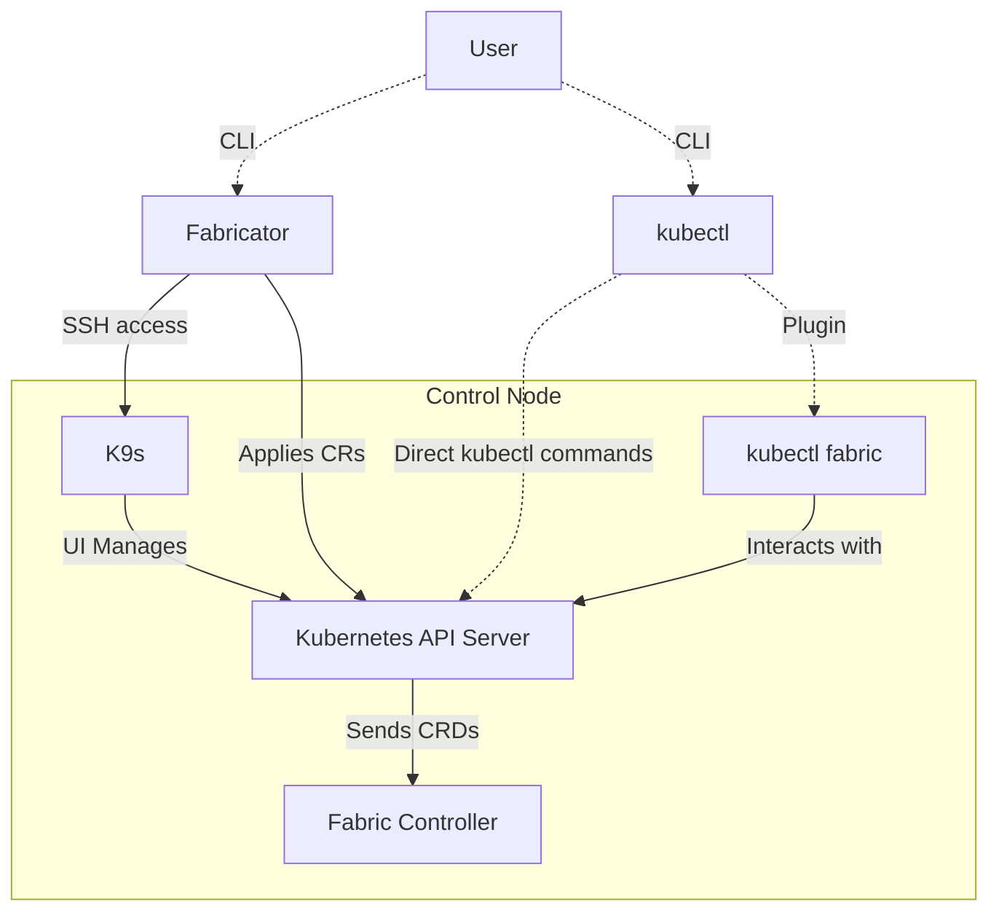
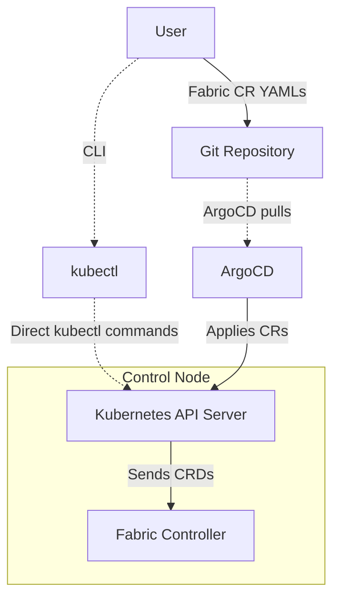

# Fabric Management

This section focuses on operational aspects of Hedgehog Fabric, explaining available tools and typical workflows for administrators. It builds upon the architectural concepts explained in the [Overview](overview.md).

The installation of a Hedgehog Fabric deployment is carried out using Fabricator (hhfab CLI). Once deployed, ongoing operations are managed via the [Kubernetes](https://kubernetes.io) CLI, [`kubectl`](https://kubernetes.io/docs/reference/kubectl/).

In this workflow, the Kubernetes API Server processes the Fabric Custom Resources (CRs) and forwards them to the Fabric Controller. The Fabric Controller then translates these high-level network intents into concrete network configurations and manages their application to the underlying infrastructure. The Controller continuously monitors the state of the network resources, ensuring they match the desired state defined in the CRs.

The diagram below illustrates the general workflow for fabric management:

---

## **Management Workflow Overview**

### **User**
- **Creates Fabric CR YAMLs** and applies them through standard Kubernetes resource management.
- **Directly interacts with SONiC switches** via the Fabricator CLI.
- **Uses [`kubectl`](https://kubernetes.io/docs/reference/kubectl/) and `kubectl fabric`** to interact with the Kubernetes API for fabric resource management.

### **Kubernetes API Server (K8S)**
- Part of [Kubernetes](https://kubernetes.io).
- Manages Fabric Custom Resources (CRs) and interacts with the **Fabric Controller**.

### **kubectl & kubectl fabric**
- [`kubectl`](https://kubernetes.io/docs/reference/kubectl/) is the standard CLI tool for [Kubernetes](https://kubernetes.io).
- `kubectl fabric` is a plugin that extends `kubectl` with fabric-specific commands and interacts with the Kubernetes API Server.

### **Fabricator**
- CLI tool that provides direct interaction with the Kubernetes API.
- Can apply configurations via **SSH access** (using **K9s**) or by directly managing Fabric CRs with YAML files.

### **K9s**
- A Kubernetes UI that provides visibility and control over Kubernetes resources, allowing you to manage pods, nodes, services, logs, and Fabric resources efficiently. It includes some helper plugins:
    - **SSH** – SSH into a fabric switch
    - **Serial** – Open a serial connection to a fabric switch
    - **Reboot** – Reboot a fabric switch
    - **Power Reset** Perform a power reset on a fabric switch in the NOS
    - **Reinstall** – Reinstall a fabric switch

---

## **GitOps Functionality (ArgoCD)**

GitOps workflows can be leveraged using [ArgoCD](https://argo-cd.readthedocs.io/en/stable/). This is an alternative approach to show that a Fabric can be used with industry standard tools seamlessly.

- **User Actions:**
    - The user **creates Fabric CR YAMLs** and pushes them to a [Git repository](https://git-scm.com) for version control.
- **ArgoCD Actions:**
    - [ArgoCD](https://argo-cd.readthedocs.io/en/stable/) monitors the Git repository.
    - ArgoCD **pulls the CRs from Git** and applies them to [Kubernetes](https://kubernetes.io) via the Kubernetes API Server.

