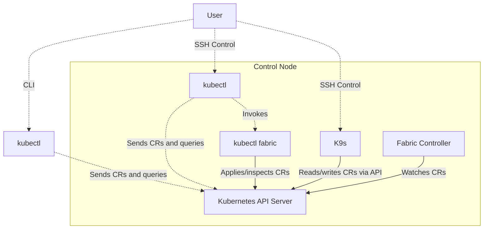
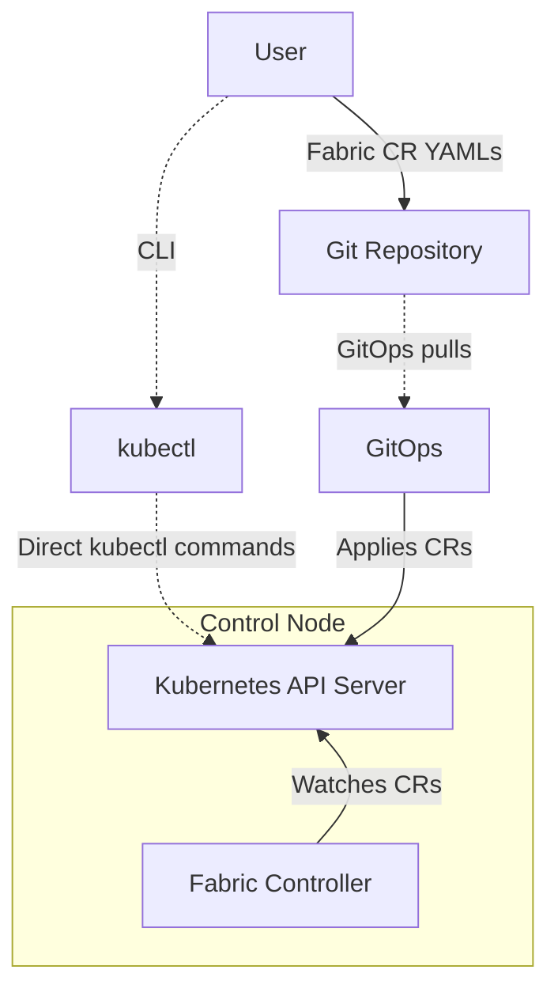

# Fabric Management

This section focuses on operational aspects of Hedgehog Fabric, explaining available tools and typical workflows for administrators. It builds upon the architectural concepts explained in the [Overview](overview.md).

The installation of a Hedgehog Fabric deployment is carried out using Fabricator (hhfab CLI). Once deployed, ongoing operations are managed via the [Kubernetes](https://kubernetes.io) CLI, [`kubectl`](https://kubernetes.io/docs/reference/kubectl/).

In this workflow, the Kubernetes API Server stores and serves the Fabric Custom Resources (CRs), which define high-level network intents. The Fabric Controller watches the API for changes to these CRs, translates them into concrete network configurations, and applies them to the underlying infrastructure. The Controller continuously monitors the actual state of the network resources to ensure they match the desired state defined in the CRs.

In this workflow, the user interacts with the Kubernetes API Server by creating or modifying Fabric Custom Resources (CRs). The Fabric Controller watches the Kubernetes API for changes to these CRs. Upon detecting a change, the Controller translates the high-level network intent into concrete configurations and applies them to the fabric switches.

The Controller continuously reconciles the actual network state with the desired state declared in the CRs, ensuring consistency and reliability across the fabric.

The diagram below illustrates the general workflow for fabric management:

---

## Management Workflow Overview

### User
- **Creates Fabric CR YAMLs** and applies them through standard Kubernetes resource management.
- **Uses [`kubectl`](https://kubernetes.io/docs/reference/kubectl/) and `kubectl fabric`** to interact with the Kubernetes API for fabric resource management.
    - Can use their **own `kubectl` installation** or the one pre-installed on the control node as part of [k3s](https://k3s.io).

### Kubernetes API Server (K8S)
- Part of [Kubernetes](https://kubernetes.io).
- Manages Fabric Custom Resources (CRs) and interacts with the **Fabric Controller**.

### kubectl & kubectl fabric
- [`kubectl`](https://kubernetes.io/docs/reference/kubectl/) is the standard CLI tool for [Kubernetes](https://kubernetes.io).
- `kubectl fabric` is a plugin that extends `kubectl` with fabric-specific commands and interacts with the Kubernetes API Server. It supports the following commands:
    - **vpc** – Manage VPCs: create, attach, peer, or wipe all related resources
    - **switch** – Manage switches: get IP, SSH, serial, reboot, reinstall
    - **connection** – View connections: management, fabric, vpc-loopback
    - **switchgroup** – Create SwitchGroups
    - **external** – Manage external BGP peers and VPC peering
    - **wiring** – Export fabric wiring diagrams
    - **inspect** – Inspect and troubleshoot fabric resources:
        - `fabric` – Overview of control nodes and switches
        - `switch`, `port` – Status, counters, and usage
        - `server`, `connection` – VPC/external attachments and link details
        - `vpc` – Subnet attachments and reachability
        - `bgp`, `lldp` – Neighbor status checks
        - `ip`, `mac` – Lookup usage across the fabric
        - `access` – Check reachability between VPCs, servers, and IPs

### Fabricator
- Using the **hhfab** CLI you can **SSH** the control node and use **K9s** or **kubectl** and **kubectl fabric** to manage or monitor Fabric API objects.

### K9s
- K9s is a terminal based Kubernetes UI that provides visibility and control over Kubernetes resources, allowing you to manage pods, nodes, services, logs, and Fabric resources efficiently. It includes some helper plugins:
    - **SSH** – SSH into a fabric switch
    - **Serial** – Open a serial connection to a fabric switch
    - **Reboot** – Reboot a fabric switch
    - **Power Reset** Perform a power reset on a fabric switch in the NOS
    - **Reinstall** – Reinstall a fabric switch

---

## GitOps Integration

GitOps is a continuous deployment approach where the desired state of a Kubernetes cluster is stored in Git. A GitOps controller monitors this repository and ensures the actual cluster state matches the declared state, using the Kubernetes API.

Hedgehog Fabric is fully compatible with GitOps workflows and can be managed declaratively using any GitOps-compatible tool such as [ArgoCD](https://argo-cd.readthedocs.io/en/stable/) or [Flux](https://fluxcd.io).

- **User Responsibilities:**
    - Define Fabric Custom Resources (CRs) in YAML.
    - Commit and push these CRs to a [Git repository](https://git-scm.com) for version control and collaboration.

- **GitOps Tool Responsibilities:**
    - Monitor the Git repository for updates.
    - Apply changes to the cluster automatically via the Kubernetes API Server.

This enables seamless integration of Hedgehog Fabric into modern CI/CD pipelines and Git-centric workflows.

