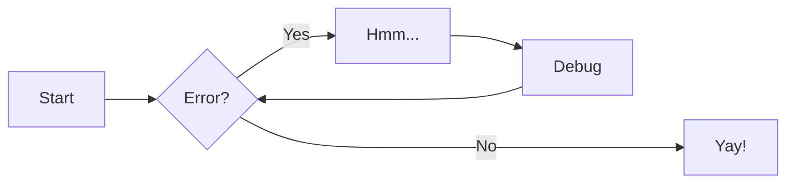
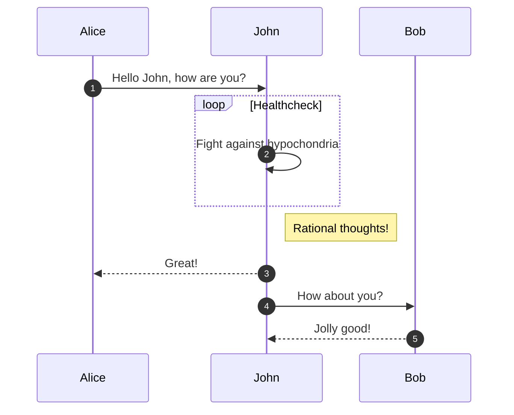

<!--@@joggrdoc@@-->
<!-- @joggr:version(v1):end -->
<!-- @joggr:warning:start -->
<!-- 
  _   _   _    __        __     _      ____    _   _   ___   _   _    ____     _   _   _ 
 | | | | | |   \ \      / /    / \    |  _ \  | \ | | |_ _| | \ | |  / ___|   | | | | | |
 | | | | | |    \ \ /\ / /    / _ \   | |_) | |  \| |  | |  |  \| | | |  _    | | | | | |
 |_| |_| |_|     \ V  V /    / ___ \  |  _ <  | |\  |  | |  | |\  | | |_| |   |_| |_| |_|
 (_) (_) (_)      \_/\_/    /_/   \_\ |_| \_\ |_| \_| |___| |_| \_|  \____|   (_) (_) (_)
                                                              
This document is managed by Joggr. Editing this document could break Joggr's core features, i.e. our 
ability to auto-maintain this document. Please use the Joggr editor to edit this document 
(link at bottom of the page).
-->
<!-- @joggr:warning:end -->
# Documentation

## Getting started

This documentation is done using [MkDocs](https://www.mkdocs.org) with multiple plugins enabled. It's based on the Markdown, you can find basic syntax overview [here](https://www.markdownguide.org/basic-syntax/).

In order to contribute to the documentation, you'll need to have Git and Docker installed on your machine as well as any editor of your choice, preferably supporting Markdown preview. You can run the preview server using following command:

``` bash
make serve
```

Now you can open continuosly updated preview of your edits in browser at [http://127.0.0.1:8000](http://127.0.0.1:8000). Pages will be automatically updated while you're editing.

Additionally you can run

```bash
make build
```

to make sure that your changes will be built correctly and doesn't break documentation.

## Workflow

If you want to quick edit any page in the documentation, you can press the `Edit this page` icon at the top right of the page. It'll open the page in the GitHub editor. You can edit it and create a pull request with your changes.

Please, never push to the `master` or `release/*` branches directly. Always create a pull request and wait for the review.

Each pull request will be automatically built and preview will be deployed. You can find the link to the preview in the comments in pull request.

## Repository

Documentation is organized in per-release branches:

- `master` - ongoing development, not released yet, referenced as `dev` version in the documentation
- `release/alpha-1`/`release/alpha-2` - alpha releases, referenced as `alpha-1`/`alpha-2` versions in the documentation, if patches released for alpha-1, they'll be merged into `release/alpha-1` branch
- `release/v1.0` - first stable release, referenced as `v1.0` version in the documentation, if patches (e.g. `v1.0.1`) released for v1.0, they'll be merged into `release/v1.0` branch

Latest release branch is referenced as `latest` version in the documentation and will be used by default when you open the documentation.

## File layout

All documentation files are located in `docs` directory. Each file is a Markdown file with `.md` extension. You can create subdirectories to organize your files. Each directory can have a `.pages` file that overrides the default navigation order and titles.

For example, top-level `.pages` in this repository looks like this:

``` yaml
nav:
  - index.md
  - getting-started
  - concepts
  - Wiring Diagram: wiring
  - Install & Upgrade: install-upgrade
  - User Guide: user-guide
  - Reference: reference
  - Troubleshooting: troubleshooting
  - ...
  - release-notes
  - contribute
```

Where you can add pages by file name like `index.md` and page title will be taked from the file (first line with `#`). Additionally, you can reference the whole directory to created nested section in navigation. You can also add custom titles by using `: ` separator like `Wiring Diagram: wiring` where `Wiring Diagram` is a title and `wiring` is a file/directory name.

More details in the [MkDocs Pages plugin](https://github.com/lukasgeiter/mkdocs-awesome-pages-plugin).

### Abbreaviations

You can find abbreviations in `includes/abbreviations.md` file. You can add various abbreviations there and all usages of the defined words in the documentation will get a highlight.

For example, we have following in `includes/abbreviations.md`:

```markdown
*[HHFab]: Hedgehog Fabricator - a tool for building Hedgehog Fabric
```

It'll highlight all usages of `HHFab` in the documentation and show a tooltip with the definition like this: HHFab.

## Markdown extensions

We're using [MkDocs Material](https://squidfunk.github.io/mkdocs-material/) theme with multiple extensions enabled. You can find detailed reference [here](https://squidfunk.github.io/mkdocs-material/reference/), but here you can find some of the most useful ones.

To view code for examples, please, check the source code of this page.

### Text formatting

Text can be {--deleted--} and replacement text {++added++}. This can also be
combined into {~~one~>a single~~} operation. {==Highlighting==} is also
possible {>>and comments can be added inline<<}.

{==

Formatting can also be applied to blocks by putting the opening and closing
tags on separate lines and adding new lines between the tags and the content.

==}

Keyboard keys can be written like so:

++ctrl+alt+del++

Amd inline icons/emojis can be added like this:

``` markdown
:fontawesome-regular-face-laugh-wink:
:fontawesome-brands-twitter:{ .twitter }
```

:fontawesome-regular-face-laugh-wink:
:fontawesome-brands-twitter:{ .twitter }

### Admonitions

Admonitions, also known as call-outs, are an excellent choice for including side content without significantly interrupting the document flow. Different types of admonitions are available, each with a unique icon and color. Details can be found [here](https://squidfunk.github.io/mkdocs-material/reference/admonitions/).

!!! info end "Lorem ipsum"

    Lorem ipsum dolor sit amet, consectetur
    adipiscing elit. Nulla et euismod nulla.
    Curabitur feugiat, tortor non consequat
    finibus, justo purus auctor massa, nec
    semper lorem quam in massa.

### Code blocks

Details can be found [here](https://squidfunk.github.io/mkdocs-material/reference/code-blocks/).

Simple code block with line nums and higlighted lines:

```py title="bubble_sort.py" hl_lines="2 3" linenums="1"
def bubble_sort(items):
    for i in range(len(items)):
        for j in range(len(items) - 1 - i):
            if items[j] > items[j + 1]:
                items[j], items[j + 1] = items[j + 1], items[j]
```

Code annotations:

```yaml
theme:
  features:
    - content.code.annotate # (1)
```

1.  :man_raising_hand: I'm a code annotation! I can contain `code`, __formatted
    text__, images, ... basically anything that can be written in Markdown.


### Tabs

You can use Tabs to better organize content.

=== "C"

    ``` c
    #include <stdio.h>

    int main(void) {
      printf("Hello world!\n");
      return 0;
    }
    ```

=== "C++"

    ``` c++
    #include <iostream>

    int main(void) {
      std::cout << "Hello world!" << std::endl;
      return 0;
    }
    ```

### Tables

| Method      | Description                          |
| :---------- | :----------------------------------- |
| `GET`       | :material-check:     Fetch resource  |
| `PUT`       | :material-check-all: Update resource |
| `DELETE`    | :material-close:     Delete resource |

### Diagrams

You can directly include Mermaid diagrams in your Markdown files. Details can be found [here](https://mermaid.js.org/config/Tutorials.html).





<!-- @joggr:editLink(3822986e-152b-4ad4-bdb0-39bd12ab4d3b):start -->
---
<a href="https://app.joggr.io/app/documents/3822986e-152b-4ad4-bdb0-39bd12ab4d3b/edit" alt="Edit doc on Joggr">
  
</a>
<!-- @joggr:editLink(3822986e-152b-4ad4-bdb0-39bd12ab4d3b):end -->