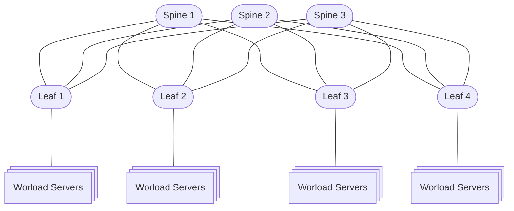
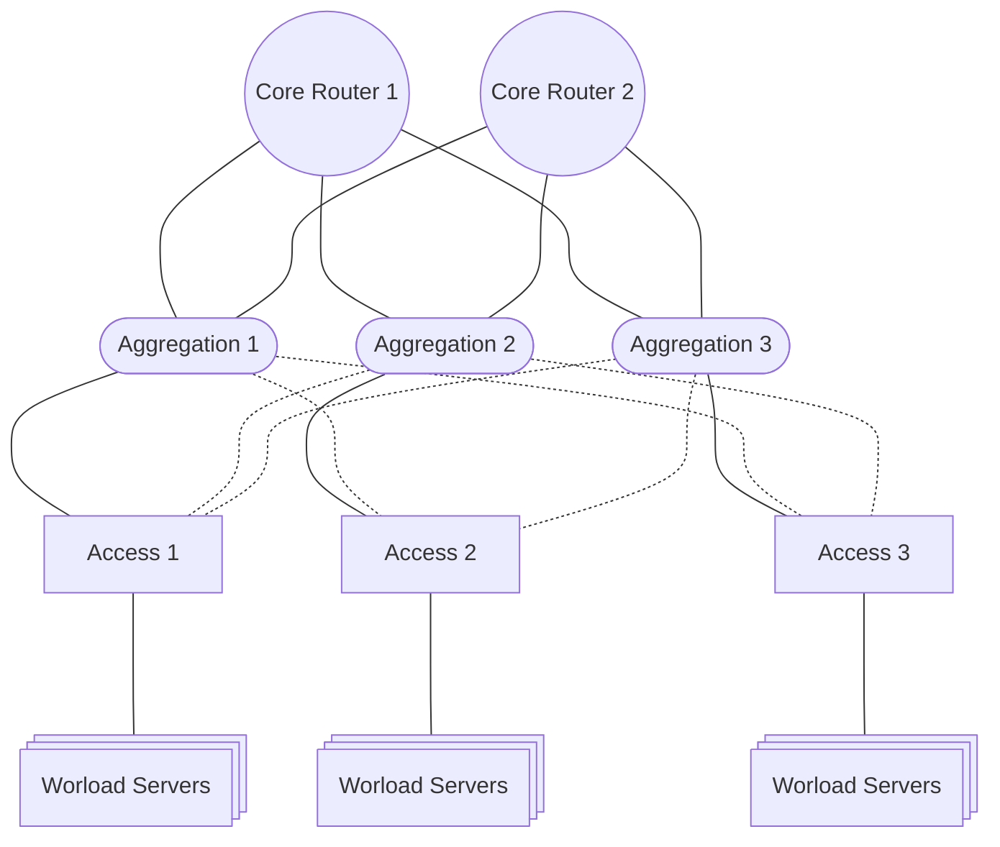

# Frequently Asked Questions (FAQ)

## What is the Hedgehog Fabric?

The Hedgehog Fabric is a topology of routers arranged in a spine-leaf architecture. A spine-leaf architecture is a type of [Clos network topology](https://en.wikipedia.org/wiki/Clos_network). In a spine-leaf architecture, the leaves are usually placed in racks and connected directly to the servers, whereas spines are connected only to leaves. In a spine-leaf architecture, the fundamental unit of connection is a layer 3 route.

The Hedgehog Fabric is managed via Kubernetes objects and custom resource definitions.

## What are the advantages of a spine-leaf architecture?

A spine-leaf architecture is designed to facilitate traffic that is passing between servers inside of a data center, other architectures like core-access-aggregation are setup to facilitate traffic moving in and out of the data center. A spine-leaf architecture provides multiple paths between nodes which allows for router maintenance and resilience in the case of failures. The spine-leaf architecture allows allows for multiple points of egress via border leaf nodes. In a spine-leaf architecture the unit of connection is a layer 3 route. There are robust tools, queueing algorithms and hardware available to manage network traffic at layer 3. To manage the distribution of routes to switches inside the fabric a protocol such as  BGP, OSPF, or IS-IS is used. 

### Spine Leaf Architecture Diagram

In the above diagram Leaf and Spine routers, servers inside of a virtual private cloud can be attached to any leaf. In order for the servers to communicate routes are applied to leaf nodes and traffic that needs to pass from leaf 1 to leaf 2 could travel via any spine. The leaf uses [ECMP](https://en.wikipedia.org/wiki/Equal-cost_multi-path_routing) to decide which spine to use. An [EVPN](https://en.wikipedia.org/wiki/Ethernet_VPN) technology ensures that servers inside of a VPC are reachable at layer2 regardless of which leaf they are attached to the fabric. 

### Core Access Aggregation Diagram

In the diagram above, the Access switches are a isolated and or managed by layer 2 constructs like ACLs, bridging, and VLANs. the Aggregation routers are where layer 2 traffic is promoted to layer 3. The core routers handle layer 3 traffic only. Often some form of Spanning Tree Protocol is used to avoid loops in the layer 2 domain. Loops would cripple the network as layer 2 often relies on Broadcast / Flooding for discovery. While there are multiple paths out from the workload servers to the core they are often not passing traffic due to the Spanning Tree Protocol, these disable links are shown as dotted lines.

## What does it mean to manage my network with Kubernetes?

A common way to manage a network is to proceed manually via the command-line interface of the equipment, or with the hardware vendor tools. Managing a small number of switches and routers this way is workable, but cumbersome, and it only gets more painful when the network grows. Managing switches and servers with Kubernetes is similar to managing pods and applications with Kubernetes: it provides assistance for deployment, scaling, and management of the network appliances.

For example, if the administrator of a Kubernetes cluster wants to create a new Nginx pod, they write down the YAML file describing the pod name, the container image, any ports that the pod needs exposed, and what namespace to run the pod in. After the YAML file is created, a simple `kubectl apply -f nginx.yaml` is all that the administrator needs to run in order for the pod to be scheduled. 

With the Hedgehog Fabric, the same principles apply to managing network resources. Administrators create a YAML file to configure a VPC. The YAML file describes the IP address range for the private cloud, for example the `192.168.0.0/16` space. It also describes any VLANs that the private cloud needs. After the desired options are in the file, administrators can push the configuration to the switch with a mere `kubectl apply -f vpc1.yaml`, and within a few seconds the switch configuration is live.

## What is a Virtual Private Cloud (VPC)
A VPC is [layer 3](https://en.wikipedia.org/wiki/Network_layer) logical isolation inside of a network. To isolate the servers a [VRF](https://en.wikipedia.org/wiki/Virtual_routing_and_forwarding) is used. A VRF allows for multiple routing tables to exist at the same time on a switch. To isolate one VPC from another there is simply no route between them.
