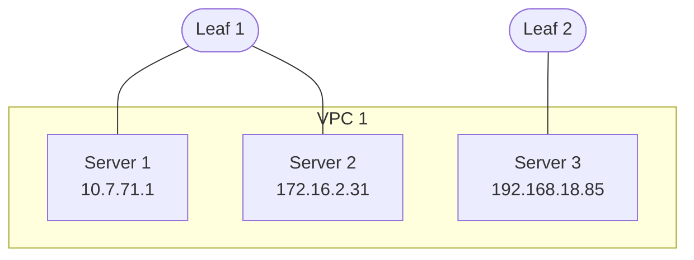
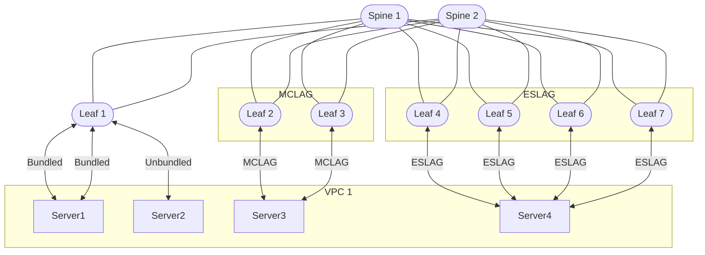
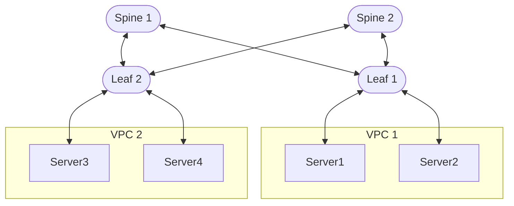
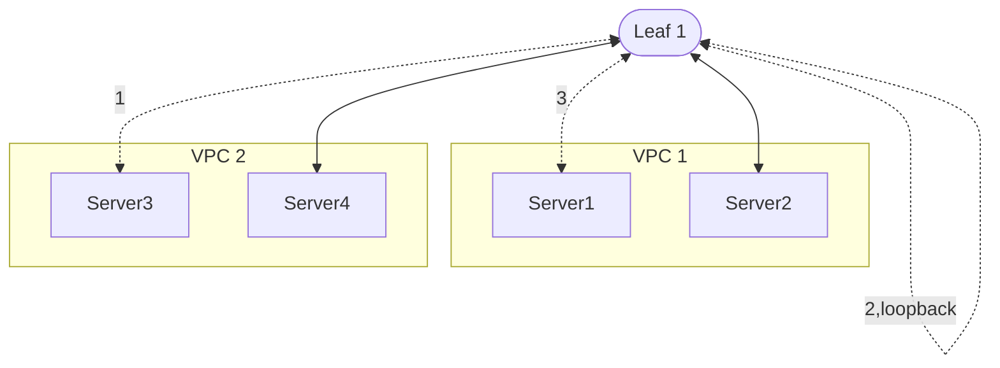
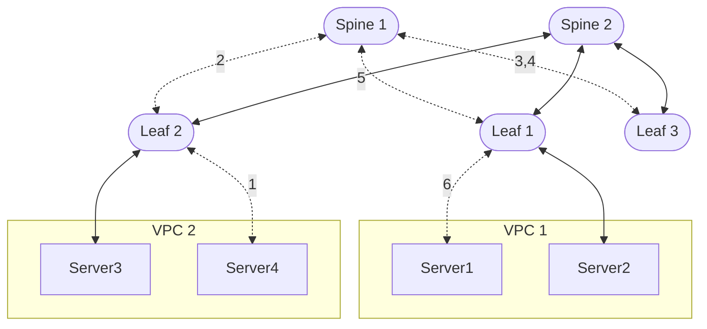

# Build Wiring Diagram

!!! note ""
    This documentation is actively maintained and updated.

## Overview

A wiring diagram expresses your network topology in YAML format, serving as a blueprint for your infrastructure. For detailed YAML specifications, refer to the User Guide section [switch features and port naming](../user-guide/profiles.md) and the [api](../reference/api.md). All switches must reference a `SwitchProfile` in the `spec.profile` of the `Switch` object. Only port names defined by switch profiles can be used in the wiring diagram - NOS (or any other) port names are not supported.

To get started with Hedgehog Fabric, you can generate a wiring diagram for a VLAB environment with flags to customize number of switches, links, servers, etc.:

```console
ubuntu@sl-dev:~$ hhfab vlab gen --help
NAME:
   hhfab vlab generate - generate VLAB wiring diagram

USAGE:
   hhfab vlab generate [command options]

OPTIONS:
   --bundled-servers value      number of bundled servers to generate for switches (only for one of the second switch in the redundancy group or orphan switch) (default: 1)
   --eslag-leaf-groups value    eslag leaf groups (comma separated list of number of ESLAG switches in each group, should be 2-4 per group, e.g. 2,4,2 for 3 groups with 2, 4 and 2 switches)
   --eslag-servers value        number of ESLAG servers to generate for ESLAG switches (default: 2)
   --fabric-links-count value   number of fabric links if fabric mode is spine-leaf (default: 0)
   --help, -h                   show help
   --mclag-leafs-count value    number of mclag leafs (should be even) (default: 0)
   --mclag-peer-links value     number of mclag peer links for each mclag leaf (default: 0)
   --mclag-servers value        number of MCLAG servers to generate for MCLAG switches (default: 2)
   --mclag-session-links value  number of mclag session links for each mclag leaf (default: 0)
   --no-switches                do not generate any switches (default: false)
   --orphan-leafs-count value   number of orphan leafs (default: 0)
   --spines-count value         number of spines if fabric mode is spine-leaf (default: 0)
   --unbundled-servers value    number of unbundled servers to generate for switches (only for one of the first switch in the redundancy group or orphan switch) (default: 1)
   --vpc-loopbacks value        number of vpc loopbacks for each switch (default: 0)
```

### Sample Switch Configuration
```yaml
apiVersion: wiring.githedgehog.com/v1beta1
kind: Switch
metadata:
  name: ds3000-02
spec:
  boot:
    serial: ABC123XYZ
  role: server-leaf
  description: leaf-2
  profile: celestica-ds3000
  portBreakouts:
    E1/1: 4x10G
    E1/2: 4x10G
    E1/17: 4x25G
    E1/18: 4x25G
    E1/32: 4x25G
  redundancy:
    group: mclag-1
    type: mclag
```

## Design Discussion
This section helps you understand how to combine the Fabric API primitives into a functional fabric.

### VPC

A VPC enables Layer 3 isolation and serves as the primary building block for network architecture. Hosts within a VPC belong to the same broadcast domain and can communicate with each other. If desired, a single VPC can be configured with multiple broadcast domains. For communication between VPCs, a *peering* connection must be established. VPCs can logically separate workloads, enabling additional controls. This separation isn't limited to traditional database, web, and compute layers - it can accommodate development teams requiring isolation, building tenants, or any other organizational structure that benefits from network control. Once VPCs are defined, you can establish traffic priorities, implement security measures, and plan the physical wiring. The fabric allows VPCs to span multiple switches, providing enhanced flexibility.


### Connection

A connection represents the physical cabling in your data center. Connections link switches to other switches or switches to servers.

#### Server Connections

A server connection links servers to the fabric. The fabric configures server-facing ports according to the connection type (MLAG, Bundle, etc). Server administrators must handle the configuration of the server side. Server port names serve as metadata to identify connections and are not validated by the fabric. Server connections include:

- *Unbundled* - A single cable connecting switch to server
- *Bundled* - Two or more cables connecting to a single switch (LAG or similar)
- *MCLAG* - Two cables connecting to two different switches (dual homing), requiring a fabric link between switches
- *ESLAG* - Two to four cables connecting to different switches (multi-homing), requiring four switches when using four links


#### Fabric Connections

Fabric connections link switches to form the network fabric.


### VPC Peering

VPC peering enables communication between VPCs and comes in two forms: local and remote.



#### Local VPC Peering

When no dedicated border/peering switch is available, local VPC peering enables direct communication between VPCs on switches where either VPC has connected workloads. Due to Sonic network operating system limitations, peering bandwidth depends on the number of VPC loopbacks configured during fabric initialization. Traffic uses the loopback interface, with bandwidth matching the loopback port's capacity.


The dotted line in the diagram shows the traffic flow for local peering. The traffic originates in VPC 2, travels to the switch, travels out the first loopback port, into the second loopback port, and finally out the port destined for VPC 1.


#### Remote VPC Peering

Remote peering utilizes a dedicated switch for VPC traffic, implemented either on a border leaf or a switch without VPC presence. This enables line-rate communication between VPCs, limited only by fabric bandwidth. While introducing additional network hops may slightly increase latency, it provides higher throughput capacity.


The dotted line in the diagram shows the traffic flow for remote peering. The traffic could take a different path because of ECMP. It is important to note that Leaf 3 cannot have any servers from VPC 1 or VPC 2 on it, but it can have a  different VPC attached to it.

#### VPC Loopback

A VPC loopback consists of a physical cable with both ends connected to the same switch, typically using adjacent ports. This configuration enables communication between different VPCs, addressing a Broadcom limitation.

