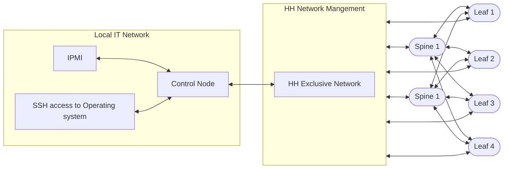

# Install Fabric

## Prerequisites

* A machine with access to the Internet to use Fabricator and build installer with at least 8 GB RAM and 25 GB of disk space
* An 16 GB USB flash drive, if you are not using virtual media
* Have a machine to function as the Fabric Control Node. [System Requirements](./requirements.md) as well as IPMI access to it to install
  the OS.
* A management switch with at least 1 10GbE port is recommended
* Enough [Supported Switches](./supported-devices.md) for your Fabric

## Overview of Install Process

This section is dedicated to the Hedgehog Fabric installation on bare-metal control node(s) and switches, their
preparation and configuration. To install the VLAB see [VLAB Overview](../vlab/overview.md).

Download and install `hhfab` following instructions from the [Download](../getting-started/download.md) section.

The main steps to install Fabric are:

1. Install `hhfab` on the machines with access to the Internet
    1. [Prepare Wiring Diagram](./build-wiring.md)
    1. [Select Fabric Configuration](./config.md)
    1. [Build Control Node configuration and installer](#build-control-node-configuration-and-installer)
1. [Install Control Node](#install-control-node)
    1. Insert USB with control-os image into Fabric Control Node
    1. Boot the node off the USB to initiate the installation
1. Prepare Management Network
    1. Connect management switch to Fabric control node
    1. Connect 1GbE Management port of switches to management switch
1. Prepare supported switches
    1. Ensure switch serial numbers and / or first management interface MAC addresses are recorded in wiring diagram
    1. Boot them into ONIE Install Mode to have them automatically provisioned

## Build Control Node configuration and Installer
Hedgehog has created a command line utility, called `hhfab`, that helps generate the wiring diagram and fabric configuration, validate the supplied configurations, and generate an installation image (.img) suitable for writing to a USB flash drive or mounting via IPMI virtual media. The first `hhfab` command to run is `hhfab init`. This will generate the main configuration file, `fab.yaml`. `fab.yaml` is responsible for almost every configuration of the fabric with the exception of the wiring. Each command and subcommand have usage messages, simply supply the `-h` flag to your command or sub command to see the available options. For example `hhfab vlab -h` and `hhfab vlab gen -h`.

### HHFAB commands to make a bootable image

1. `hhfab init --wiring wiring-lab.yaml`
1. The `init` command generates a `fab.yaml` file, edit the `fab.yaml` file for your needs
    1. ensure the correct boot disk (e.g. `/dev/sda`) and control node NIC names are supplied
1. `hhfab validate`
1. `hhfab build --mode iso`
    1. There are two options for the format of the bootable media. ISO and IMG. An ISO is best suited to use with IPMI based virtual media. The img file is designed for writing to a removable USB drive.

The installer for the fabric is generated in `$CWD/result/`. This installation image is named `control-1-install-usb.iso` and is 7.5 GB in size. Once the image is created, you can write it to a USB drive, or mount it via virtual media.

### Write USB Image to Disk

!!! warning ""
    This will erase data on the USB disk.

### Steps for Linux
1. Insert the USB to your machine
1. Identify the path to your USB stick, for example: `/dev/sdc`
1. Issue the command to write the image to the USB drive
    - `sudo dd if=control-1-install-usb.iso of=/dev/sdc bs=4k status=progress`

### Steps for MacOS
1. Plug the drive into the computer
1. Open the terminal
1. Identify the drive using `diskutil list`
1. Unmount the disk `diskutil unmount disk5`, the disk is specific to your environment
1. Write the image to the disk: `sudo dd if=./control-1-install-usb.iso of=/dev/disk5 bs=4k status=progress`

There are utilities that assist this process such as [etcher](https://etcher.balena.io/).

## Install Control Node

This control node should be given a static IP address. Either a lease or statically assigned.

1. Configure the server to use UEFI boot **without** secure boot

1. Attach the image to the server either by inserting via USB, or attaching via virtual media

1. Select boot off of the attached media, the installation process is **automated**

1. Once the control node has booted, it logs in automatically and begins the installation process
    1. Optionally use `journalctl -f -u flatcar-install.service` to monitor progress

1. Once the installation is complete, the system automatically reboots.

1. After the system has shutdown but before the boot up process reaches the operating system, **remove the USB image from the system**. Removal during the UEFI boot screen is acceptable.

1. Upon booting into the freshly installed system, the fabric installation will **automatically begin**
    1. If the insecure `--dev` flag was passed to `hhfab init` the password for the `core` user is `HHFab.Admin!`, the switches have two users created `admin` and `op`. `admin` has administrator privileges and password `HHFab.Admin!`, whereas the `op` user is a read-only, non-sudo user with password `HHFab.Op!`.
    1. Optionally this can be monitored with `journalctl -f -u fabric-install.service`

1. The install is complete when the log emits "Control Node installation complete". Additionally, the systemctl status will show `inactive (dead)` indicating that the executable has finished.

### Configure Management Network

The control node is dual-homed. It has a 10GbE interface that connects to the management network. The other link called `external` in the `fab.yaml` file is for the customer to access the control node via their building IT network. The management network is for the command and control of the switches that comprise the fabric. This management network can be a simple broadcast domain with layer 2 connectivity. The control node will run a DHCP and small http servers. The management network is not accessible to machines or devices not associated with the fabric. The following diagram illustrates 3 networks for the control node. A "Local IT"  network that is used for command and control or IPMI. The other network is exclusive to Hedgehog, the best solution is a dedicated network switch, but a private exclusive vlan is potentially workable.

### Fabric Manages Switches

Now that the install has finished, you can start interacting with the Fabric using `kubectl`, `kubectl fabric` and `k9s`, all pre-installed as part of the Control Node installer.

At this stage, the fabric hands out DHCP addresses to the switches via the management network. Optionally, you can monitor this process by going through the following steps:
- enter `k9s` at the command prompt
- use the arrow keys to select the pod named `fabric-boot`
- the logs of the pod will be displayed showing the DHCP lease process
- use the switches screen of `k9s` to see the heartbeat column to verify the connection between switch and controller.
    - to see the switches type `:switches` (like a vim command) into `k9s`
