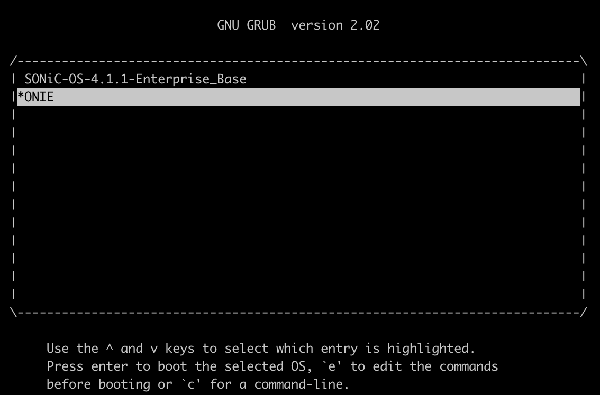

# ONIE Update/Upgrade

## Hedgehog ONIE (HONIE) Supported Systems

* DELL
    * S5248F-ON
    * S5232F-ON

* Edge-Core
    * DCS501 (AS7726-32X)
    * DCS203 (AS7326-56X)
    * EPS203 (AS4630-54NPE)

## Updating ONIE

### Via USB

This example shows how to update a DELL S5248 to Hedgehog ONIE (HONIE).

!!! note ""
    Note: the USB port is on the back of the switch with the Management and Console.

1. Prepare the USB stick by burning the honie-usb.img to a 4G or larger USB drive.

2. Insert the USB drive into the switch. For example, burn the file to disk `X` of a macOS machine with
   `sudo dd if=honie-usb.img of=/dev/rdiskX bs=1m`.

3. Boot into ONIE Installer

    * First select ONIE:
      

    * Then request the installation:
      

4. ONIE will install the ONIE update and reboot. Here are some sample logs:

    ```hl_lines="3 38"
    ONIE: OS Install Mode ...
    Platform  : x86_64-dellemc_s5200_c3538-r0
    Version   : 3.40.1.1-7 <- Non HONIE version
    Build Date: 2020-03-24T20:44-07:00
    Info: Mounting EFI System on /boot/efi ...
    Info: BIOS mode: UEFI
    Info: Making NOS install boot mode persistent.
    Info: Using eth0 MAC address: 3c:2c:30:66:f0:00
    Info: eth0:  Checking link... up.
    Info: Trying DHCPv4 on interface: eth0
    Warning: Unable to configure interface using DHCPv4: eth0
    ONIE: Using link-local IPv4 addr: eth0: 169.254.95.249/16
    Starting: klogd... done.
    Starting: dropbear ssh daemon... done.
    Starting: telnetd... done.
    discover: installer mode detected.  Running installer.
    Starting: discover... done.
    Please press Enter to activate this console. Info: eth0:  Checking link... up.
    Info: Trying DHCPv4 on interface: eth0
    Warning: Unable to configure interface using DHCPv4: eth0
    ONIE: Using link-local IPv4 addr: eth0: 169.254.6.139/16
    ONIE: Starting ONIE Service Discovery
    Info: Attempting file://dev/sdb1/onie-installer-x86_64-dellemc_s5248f_c3538-r0 ...
    Info: Attempting file://dev/mmcblk0p1/onie-installer-x86_64-dellemc_s5248f_c3538-r0 ...
    Info: Attempting file://dev/mmcblk0p1/onie-installer-x86_64-dellemc_s5248f_c3538-r0.bin ...
    Info: Attempting file://dev/mmcblk0p1/onie-installer-x86_64-dellemc_s5248f_c3538.bin ...
    Info: Attempting file://dev/mmcblk0p1/onie-installer-dellemc_s5248f_c3538 ...
    Info: Attempting file://dev/mmcblk0p1/onie-installer-dellemc_s5248f_c3538.bin ...
    Info: Attempting file://dev/mmcblk0p1/onie-installer-x86_64-bcm ...
    Info: Attempting file://dev/mmcblk0p1/onie-installer-x86_64-bcm.bin ...
    Info: Attempting file://dev/mmcblk0p1/onie-installer-x86_64 ...
    Info: Attempting file://dev/mmcblk0p1/onie-installer-x86_64.bin ...
    Info: Attempting file://dev/mmcblk0p1/onie-installer ...
    Info: Attempting file://dev/mmcblk0p1/onie-installer.bin ...
    ONIE: Executing installer: file://dev/sdb1/onie-installer-x86_64-dellemc_s5248f_c3538-r0
    Verifying image checksum ... OK.
    Preparing image archive ... OK.
    ONIE: Version       : 3.40.1.1-8 <- HONIE Version
    ONIE: Architecture  : x86_64
    ONIE: Machine       : dellemc_s5200_c3538
    ONIE: Machine Rev   : 0
    ONIE: Config Version: 1
    ONIE: Build Date    : 2023-12-15T23:43+00:00
    Installing ONIE on: /dev/sda
    ONIE: NOS install successful: file://dev/sdb1/onie-installer-x86_64-dellemc_s5248f_c3538-r0
    ONIE: Rebooting...
    discover: installer mode detected.
    Stopping: discover...start-stop-daemon: warning: killing process 665: No such process
    Info: Unmounting kernel filesystems
    umount: can't unmount /: Invalid argument
    The system is going down NOW!
    Sent SIGTERM to all processes
    Sent SIGKILL to all processes
    Requesting system reboot
    ```

5. The system is now ready for use.
