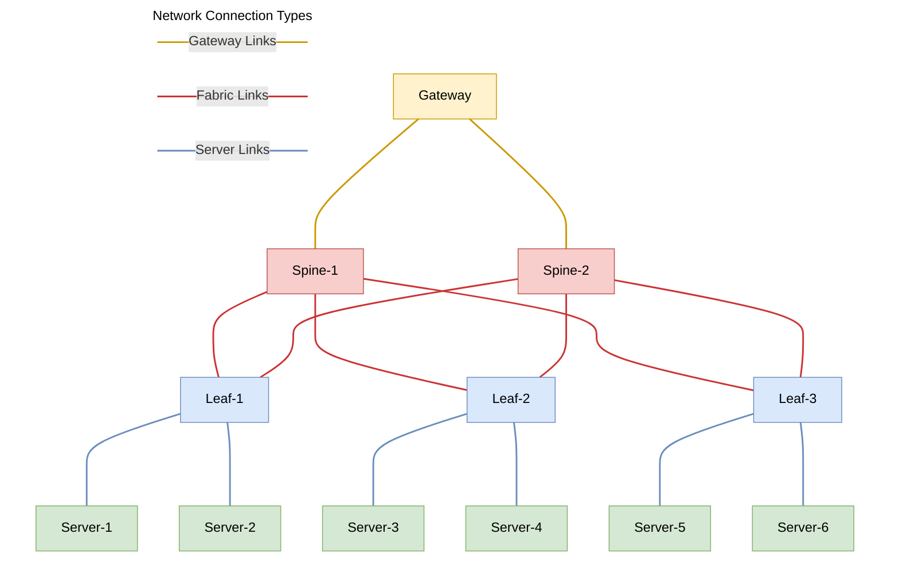

# Gateway

The Gateway adds advanced network service capabilities to the fabric,
complementing its fast, scalable connectivity. The fabric delivers efficient,
cut-through transport between workloads, while the Gateway provides additional
capabilities such as NAT, PAT, and firewalling. Simple [VPC Peerings](vpcs.md#vpcpeering) use the
full bandwidth of the fabric, whereas traffic using Gateway services is
handled through the Gateway nodes, which determine the available throughput.
Together, they offer both high-performance connectivity and rich network services.

## Gateway Nodes and Fabric Connectivity

Gateway nodes are connected to the fabric by a set of physical connections that are modeled via Connection objects.
See the section on [Gateway Connections](connections.md#gateway-connections) for connection requirements and example configuration.

When a Gateway Peering is used to connect two VPCs or externals, the gateway nodes attract traffic to themselves by advertising the appropriate routes to the fabric.
In turn, the fabric uses these routes to steer traffic to the gateway so that
the gateway can apply the configured peering policy.

Gateway nodes use BGP to advertise routes to the fabric, and the gateway gets its own ASN so it is possible to easily identify gateway-advertised routes in the fabric.



## Gateway Peering

Just as [VPC Peerings](vpcs.md#vpcpeering) provide VPC-to-VPC connectivity by way of the switches in the fabric, gateway peerings provide connectivity via the gateway nodes.
Gateway services can be inserted between a pair of VPCs or a VPC and an external using a Gateway Peering.
Each peering can be configured to provide the necessary services for traffic
that uses that peering. Peering the same entities via gateway and fabric
at the same time results in undefined behaviour. If two entities (VPCs or externals) are already
peered via the fabric, delete this peering first, then peer them via the
gateway.

### Simple Gateway Peering Between VPCs

A simple peering with no services deployed between the VPCs. This traffic will
transit the gateway node(s).

```{.yaml .annotate linenums="1" title="gw-peer.yaml"}
apiVersion: gateway.githedgehog.com/v1alpha1
kind: Peering
metadata:
  name: vpc-1--vpc-2
  namespace: default
spec:
  peering:
    vpc-1:
      expose:
        - ips:
          - cidr: 10.0.0.0/24 # Expose all IP address in the 10.0.0.0/24 CIDR block to vpc-2
    vpc-2:
      expose:
        - ips:
          - cidr: 192.168.0.0/16 # Expose all IP addresses in the 192.168.0.0/16 CIDR block to vpc-1
```

### Gateway Peering with Stateless NAT

Stateless NAT translates source and/or destination IP addresses for all packets that traverse
the peering, but it does not maintain any flow state for the connection. A 
one-to-one mapping is established between the addresses exposed in the CIDRs for
`ips` and the addresses to use represented by the CIDRs in
`as`: each address from the first group is consistently mapped to a single
address from the second group. Therefore, the total number of addresses covered
by the CIDRs YAML array entries from `ips` must be equal to the total number of
addresses covered by the CIDRs from `as`.

```{.yaml .annotate linenums="1" title="sl-gw-peer.yaml"}
apiVersion: gateway.githedgehog.com/v1alpha1
kind: Peering
metadata:
  name: vpc-1--sl-nat--vpc-2
  namespace: default
spec:
  peering:
    vpc-1:
      expose:
        - ips:
          - cidr: 10.0.1.0/24 # IP addresses in the 10.0.1.0/24 block will be exposed ...
          as:
          - cidr: 10.11.11.0/24 # as IP addresses in the 10.11.11.0/24 block.
        - ips:
          - cidr: 10.0.2.3/32 # This single IP address will be reachable...
          as:
          - cidr: 10.11.22.3/32 # as this IP address in vpc-2.
    vpc-2:
      expose:
        - ips:
          - cidr: 10.0.2.0/24 # A /24 can be split into two ranges
          as:
          - cidr: 10.22.22.0/25 # and exposed back to vpc-1.
          - cidr: 10.22.22.128/25


```


### Gateway Peering with Stateful Source NAT

Stateful source NAT uses a flow table to track established connections.
When traffic is initiated from `vpc-1` to `vpc-2`, the flow table is updated 
with the connection details. In the return direction (from `vpc-2` to `vpc-1`
in the following example), the flow table is consulted to determine if the packet
is part of an established connection. If it is, the packet is allowed to pass 
through the peering. If it is not, the packet is dropped.
This behavior allows use of stateful NAT as a simple firewall.

```{.yaml .annotate linenums="1" title="gw-sf-nat-peer.yaml"}
apiVersion: gateway.githedgehog.com/v1alpha1
kind: Peering
metadata:
  name: vpc-1--sf-nat--vpc-2
  namespace: default
spec:
  peering:
    vpc-1:
      expose:
        # Allow 10.0.0.0/24 addresses to talk to vpc-2
        # Because of stateful NAT, traffic from vpc-2 to vpc-1 is only allowed if there is
        # a flow table entry created by a traffic initiated from vpc-1 to vpc-2.
        - ips:
          - cidr: 10.0.0.0/24
          as:
          - cidr: 10.0.1.0/31  # but, NAT those addresses using the addresses in 10.0.1.0/31
          nat:  # Contains the NAT configuration
          # Make NAT stateful, connections initiated from vpc-1 to vpc-2 will be added to the flow table. 
          # An entry for the reverse direction will be added too, so that the receiving endpoint in vpc-2 can reply.
            stateful: 
              idleTimeout: 5m # Timeout connections after 5 minutes of inactivity (no packets received)
    vpc-2:
      expose:
        # Allows traffic from vpc-1 to vpc-2 on these addresses.
        # Connections must be initiated from vpc-1 to vpc-2 due to flow tracking.
        - ips:
          - cidr: 192.168.0.0/16
        # Currently, only one VPC of a peering can use stateful NAT.
        # This restriction will be lifted in a future release.
```


### Gateway Peering for External Connections

The following YAML listings show how to expose a default route to the
`10.50.2.0/24` subnet inside of `vpc-02`. In this example the name of the
external is `example-ext`. Assuming this external is representing the WAN, this will
allow hosts inside of the `10.50.2.0/24` to the WAN. The following is an
example YAML file to create an external.

```{.yaml .annotate linenums="1" title="example-external.yaml"}
apiVersion: vpc.githedgehog.com/v1beta1
kind: External
metadata:
  name: example-ext
  namespace: default
spec:
  inboundCommunity: 65102:5001
  ipv4Namespace: default
  outboundCommunity: 5001:65102

```

Once the external is created, the gateway can be used to create a peering
between the external and a VPC. The following YAML is an example of this
configuration. Note that the name of the external is prefixed with `ext.`.

```{.yaml .annotate linenums="1" title="gw-peer-external.yaml"}
apiVersion: gateway.githedgehog.com/v1alpha1
kind: Peering
metadata:
  name: vpc-02--example-ext
spec:
  peering:
    ext.example-ext: # NOTE the name of the external is prefixed with "ext."
      expose:
      - ips:
        - cidr: 0.0.0.0/0
    vpc-02:
      expose:
      - ips:
        - cidr: 10.50.2.0/24
```
