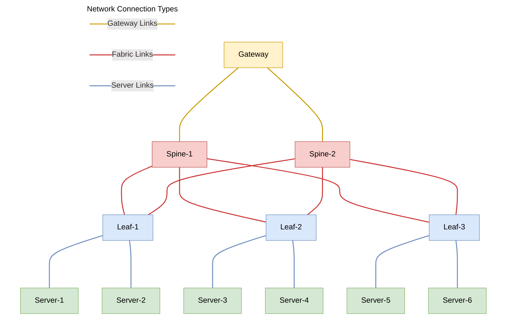

# Gateway overview

The Gateway adds advanced network service capabilities to the fabric,
complementing its fast, scalable connectivity. The fabric delivers efficient,
cut-through transport between workloads, while the Gateway provides additional
capabilities such as NAT, PAT, and firewalling. Simple [VPC Peerings](vpcs.md#vpcpeering) use the
full bandwidth of the fabric, whereas traffic using Gateway services is
handled through the Gateway nodes, which determine the available throughput.
Together, they offer both high-performance connectivity and rich network services.

## Gateway Nodes and Fabric Connectivity

Gateway nodes are connected to the fabric by a set of physical connections that are modeled via Connection objects.
See the section on [Gateway Connections](connections.md#gateway-connections) for connection requirements and example configuration.

When a Gateway Peering is used to connect two VPCs or externals, the gateway nodes attract traffic to themselves by advertising the appropriate routes to the fabric.
In turn, the fabric uses these routes to steer traffic to the gateway so that
the gateway can apply the configured peering policy.

Gateway nodes use BGP to advertise routes to the fabric, and the gateway gets its own ASN so it is possible to easily identify gateway-advertised routes in the fabric.


```mermaid
graph TD

%% Style definitions
classDef gateway fill:#FFF2CC,stroke:#CC9900,stroke-width:1px,color:#000
classDef spine   fill:#F8CECC,stroke:#B85450,stroke-width:1px,color:#000
classDef leaf    fill:#DAE8FC,stroke:#6C8EBF,stroke-width:1px,color:#000
classDef server  fill:#D5E8D4,stroke:#82B366,stroke-width:1px,color:#000
classDef hidden fill:none,stroke:none
classDef legendBox fill:none,stroke:none,color:#000

%% Network diagram

Gateway_01["Gateway"]

subgraph Spines[" "]
    direction LR
    Spine_01["Spine-1"]
    Spine_02["Spine-2"]
end

subgraph Leaves[" "]
    direction LR
    Leaf_01["Leaf-1"]
    Leaf_02["Leaf-2"]
    Leaf_03["Leaf-3"]
end

subgraph Servers[" "]
    direction TB
    Server_01["Server-1"]
    Server_02["Server-2"]
    Server_03["Server-3"]
    Server_04["Server-4"]
    Server_05["Server-5"]
    Server_06["Server-6"]
end

%% Connections

%% Gateway_01 -> Spines
Gateway_01 --- Spine_01
Gateway_01 --- Spine_02

Spine_01 --- Leaf_01
Spine_01 --- Leaf_02
Spine_01 --- Leaf_03
Spine_02 --- Leaf_01
Spine_02 --- Leaf_02
Spine_02 --- Leaf_03

%% Leaves -> Servers
Leaf_01 --- Server_01
Leaf_01 --- Server_02
Leaf_02 --- Server_03
Leaf_02 --- Server_04
Leaf_03 --- Server_05
Leaf_03 --- Server_06

subgraph Legend["Network Connection Types"]
    direction LR
    %% Create invisible nodes for the start and end of each line
    L1(( )) --- |"Gateway Links"| L2(( ))
    L7(( )) --- |"Fabric Links"| L8(( ))
    L9(( )) --- |"Server Links"| L10(( ))
end

class Gateway_01 gateway
class Spine_01,Spine_02 spine
class Leaf_01,Leaf_02,Leaf_03 leaf
class Server_06,Server_05,Server_04,Server_03,Server_02,Server_01 server
class L1,L2,L7,L8,L9,L10 hidden
class Legend legendBox
linkStyle default stroke:#666,stroke-width:2px
linkStyle 0,1 stroke:#CC9900,stroke-width:2px
linkStyle 2,3,4,5,6,7 stroke:#CC3333,stroke-width:2px
linkStyle 8,9,10,11,12,13 stroke:#6C8EBF,stroke-width:2px
linkStyle 14 stroke:#CC9900,stroke-width:2px
linkStyle 15 stroke:#CC3333,stroke-width:2px
linkStyle 16 stroke:#6C8EBF,stroke-width:2px

%% Make subgraph containers invisible
style Spines fill:none,stroke:none
style Leaves fill:none,stroke:none
style Servers fill:none,stroke:none
```

## Gateway Peering

Just as [VPC Peerings](vpcs.md#vpcpeering) provide VPC-to-VPC connectivity by way of the switches in the fabric, gateway peerings provide connectivity via the gateway nodes.
Gateway services can be inserted between a pair of VPCs or a VPC and an external using a Gateway Peering.
Each peering can be configured to provide the necessary services for traffic
that uses that peering. 

!!! warning
    Peering the same entities via gateway and fabric at the same time results in undefined behavior.
    If two entities (VPCs or externals) are already peered via the fabric, delete this peering first,
    then peer them via the gateway.

### Simple Gateway Peering Between VPCs

A simple peering with no services deployed between the VPCs. This traffic will
transit the gateway node(s).

```{.yaml .annotate linenums="1" title="gw-peer.yaml"}
apiVersion: gateway.githedgehog.com/v1alpha1
kind: GatewayPeering
metadata:
  name: vpc-1--vpc-2
  namespace: default
spec:
  peering:
    vpc-1:
      expose:
        - ips:
          - cidr: 10.0.0.0/24 # Expose all IP address in the 10.0.0.0/24 CIDR block to vpc-2
    vpc-2:
      expose:
        - ips:
          - cidr: 192.168.0.0/16 # Expose all IP addresses in the 192.168.0.0/16 CIDR block to vpc-1
```

Note that multiple VPCs cannot expose overlapping prefixes to a given VPC. For
example, if `vpc-1` and `vpc-3` are both peered with `vpc-2`, and `vpc-1`
exposes subnet `10.1.1.0/24` to `vpc-2`, then `vpc-3` cannot expose overlapping
prefix `10.1.0.0/16` to `vpc-2`. There is one exception to this rule: exposed
prefixes can overlap with an expose block marked as `default`, see section on
[peering for external connections](#gateway-peering-for-external-connections)
for details.

### Gateway Peering with Static (Stateless) NAT

Static NAT translates source and/or destination IP addresses for all packets that traverse
the peering, but it does not maintain any flow state for the connection; in other words,
it is stateless. A one-to-one mapping is established between the addresses exposed in the CIDRs for
`ips` and the addresses to use represented by the CIDRs in `as`: each address from
the first group is consistently mapped to a single address from the second group.
Therefore, the total number of addresses covered by the CIDRs YAML array entries
from `ips` must be equal to the total number of addresses covered by the CIDRs from `as`.

```{.yaml .annotate linenums="1" title="gw-static-nat-peer.yaml"}
apiVersion: gateway.githedgehog.com/v1alpha1
kind: GatewayPeering
metadata:
  name: vpc-1--static--vpc-2
  namespace: default
spec:
  peering:
    vpc-1:
      expose:
        - ips:
          - cidr: 10.0.1.0/24 # IP addresses in the 10.0.1.0/24 block will be exposed ...
          as:
          - cidr: 10.11.11.0/24 # as IP addresses in the 10.11.11.0/24 block.
          nat:
            static: {}
        - ips:
          - cidr: 10.0.2.3/32 # This single IP address will be reachable...
          as:
          - cidr: 10.11.22.3/32 # as this IP address in vpc-2.
          nat:
            static: {}
    vpc-2:
      expose:
        - ips:
          - cidr: 10.0.2.0/24 # A /24 can be split into two ranges
          as:
          - cidr: 10.22.22.0/25 # and exposed back to vpc-1.
          - cidr: 10.22.22.128/25
          nat:
            static: {}
```

### Gateway Peering with Stateful NAT

Stateful NAT uses a flow table to track established connections; the decision on the action
to take for a packet depends on both the configuration of the peering and the flow table state.

There are two flavors of stateful NAT, depending on in which direction of the traffic the rule applies:
masquerade and port-forwarding.

!!! note
    If one side of a gateway peering (i.e. one VPC or external) uses "stateful NAT", such
    as masquerade and/or port forwarding, the other side cannot use NAT of any type.
    This limitation will be lifted in an upcoming release.

#### Masquerade (Stateful Source NAT)

Stateful source NAT, also referred to as _masquerade_, uses a flow table to track established connections.
When traffic is initiated from `vpc-1` to `vpc-2`, the flow table is updated
with the connection details. In the return direction (from `vpc-2` to `vpc-1`
in the following example), the flow table is consulted to determine if the packet
is part of an established connection. If it is, the packet is allowed to pass
through the peering. If it is not, the packet is dropped.
This behavior allows the use of masquerading as a simple firewall.

```{.yaml .annotate linenums="1" title="gw-masquerade-nat-peer.yaml"}
apiVersion: gateway.githedgehog.com/v1alpha1
kind: GatewayPeering
metadata:
  name: vpc-1--masquerade--vpc-2
  namespace: default
spec:
  peering:
    vpc-1:
      expose:
        # Allow 10.0.0.0/24 addresses to talk to vpc-2
        # Because of stateful source NAT, traffic from vpc-2 to vpc-1 is only allowed if there is
        # a flow table entry created by a traffic flow initiated from vpc-1 to vpc-2.
        - ips:
          - cidr: 10.0.0.0/24
          as:
          - cidr: 10.0.1.0/31  # but, NAT those addresses using the addresses in 10.0.1.0/31
          nat:
            masquerade: # Stateful source NAT: connections initiated from vpc-1 to vpc-2 will be added to the flow table
              idleTimeout: 5m0s # Timeout connections after 5 minutes of inactivity (no packets received)
    vpc-2:
      expose:
        # Allows traffic from vpc-1 to vpc-2 on these addresses.
        # Connections must be initiated from vpc-1 to vpc-2 due to flow tracking.
        - ips:
          - cidr: 192.168.0.0/16
        # Currently, only one of the two VPCs of a peering can use stateful NAT
        # (i.e. masquerade and/or port-forwarding). This restriction will be lifted in a future release.
```

In this example, a host in `vpc-1` with an IP address in the range `10.0.0.0/24` - for example
`10.0.0.4` - can send packets to a host in `vpc-2` with an address in the range `192.168.0.0/16` -
for example `192.168.5.32`. The host in `vpc-2` will see those packets arrive with a source address
in the range `10.0.1.0/31` - for example `10.0.1.1`; the reverse translation will be done on the gateway
for return traffic, and the hosts are going to be able to communicate with each other.
However, with masquerade, only hosts in `vpc-1` can initiate connections. If that same host behind
`192.168.5.32` in `vpc-2` attempts to connect to that same address `10.0.1.1` before the host in `vpc-1`
has initiated the connection flow - or after the idle timeout has expired without any packet being sent
between the pair - the gateway will drop those packets and the connection will not succeed.
The default idle timeout for masquerade is 2 minutes.

#### Port-Forwarding (Stateful Destination NAT)

Port-Forwarding is the complement to masquerading, in that it enables connection
flows initiated from the remote side. One use case for this would be
to allow external services to connect to a host in a VPC on a specific port
or range of ports, while rejecting connections outside of that range.

The following YAML fragment is an example with port forwarding configured on
`vpc-1`'s side:

```{.yaml .annotate linenums="1" title="gw-pf-peer.yaml"}
apiVersion: gateway.githedgehog.com/v1alpha1
kind: GatewayPeering
metadata:
  name: vpc-1--pf--vpc-2
  namespace: default
spec:
  peering:
    vpc-1:
      expose:
        - ips:
          - cidr: 10.0.1.3/32 # the real IPs of the hosts we want to use internally in the VPC
          as:
          - cidr: 192.168.11.20/32 # the "public" IPs that can be used to reach those hosts
          nat:
            portForward:
              idleTimeout: 10m0s # Timeout connections after 10 minutes of inactivity (no packets received)
              ports:
                - proto: tcp  # one of tcp or udp, or empty for both
                  port: "22"  # the real port (or port range) on the host where the traffic will be sent
                  as: "22101" # the port (or port range) the sender will use as the destination on the public IPs above
    vpc-2:
      expose:
        - ips:
          - cidr: 10.0.2.0/24
        # Currently, only one of the two VPCs of a peering can use stateful NAT
        # (i.e. masquerade and/or port-forwarding). This restriction will be lifted in a future release.
```

In this example, hosts in `vpc-2` with an IP address in the range `10.0.2.0/24` can connect
to `192.168.11.20` via TCP on port `22101`, and this will be mapped to port `22`
of host `10.0.1.3` in `vpc-1`, e.g. allowing them to ssh into it.

The fields `port` and `as` under `ports` accept a string with a single port or a port range;
a range should be specified with the lower and higher bounds (inclusive) separated with a dash.
Spaces are not allowed within the string for ports or port ranges. For example, both `"245"` and
`"435-512"` are valid entries, while `"340-237"`, `340` (with no quotes), `"2,3"`, or `"122 - 234"` are not.

!!! warning
    Port-Forwarding tracks the state of TCP flows. It is recommended to use TCP keepalives
    or application-layer keepalives to avoid flows from expiring due to inactivity, which
    would cause subsequent packets from those flows to be dropped.

    The default timeout for TCP is 30 minutes, starting from the time the flow reaches the
    established state. For UDP, it is 30 seconds, starting from when there's bidirectional
    communication; since UDP is stateless, this is less problematic.

### Gateway Peering for External Connections

Gateway peerings can also be used to peer a VPC with an [External](external.md).
The following YAML is an example configuration for a peering between VPC `vpc-02`
and External `example-ext`:

```{.yaml .annotate linenums="1" title="gw-peer-external.yaml"}
apiVersion: gateway.githedgehog.com/v1alpha1
kind: GatewayPeering
metadata:
  name: vpc-02--example-ext
  namespace: default
spec:
  peering:
    ext.example-ext: # NOTE the name of the external is prefixed with "ext."
      expose:
      - default: true # Fallback destination when no other expose matches
    vpc-02:
      expose:
      - ips:
        - cidr: 10.50.2.0/24
```

Note that the name of the external is prefixed with `ext.`: this is a
requirement.

Also, note how the external uses `default: true` instead of specifying the root
IPv4 prefix `0.0.0.0/0`. An `expose` block marked as `default: true` serves as
a default destination for all addresses _that do not otherwise match any of the
other prefixes exposed to the VPC_, whether or not these prefixes are from the
same peering. In our example, if `vpc-02` is additionally peered with `vpc-03`
which exposes `10.50.3.0/24`, all packets from `vpc-02` towards this subnet are
sent to `vpc-03`, and packets addressed to all other subnets from the IPv4
space are sent to the external `example-ext`.

For any given VPC, at most one remote `expose` block, among all peerings for
this VPC, can act as a `default` destination.

## Example Use Case: Gateway External Peering with Masquerade and Port-Forwarding

Let's see how everything we have discussed so far can be used to support a reasonable
external connectivity use case.

We will assume that our Fabric is connected to an external endpoint providing
Internet connectivity. We want hosts on one of our VPCs to be able to reach the
Internet despite having a private IP address in the VPC subnet range; additionally,
we want to expose some ports on the VPC hosts via a public IP, so that we can connect
to a locally running service from the outside. Naturally, we want to keep the hosts isolated otherwise.

First, let's create the `External` object and its attachment to a border leaf `leaf-01`.
Let's assume the external is managed by an ISP which does not want to BGP peer with us;
instead, it provides a default route with a /31 nexthop on a VLAN connection. We will use a static external
with proxy-ARP to connect the border leaf to the external, and later we will configure
the gateway peering to masquerade traffic from our VPC hosts using the IP address that the external
believes it is directly connected to, so that the external will see the outgoing traffic as if it was coming
directly from the border leaf.

```{.yaml .annotate linenums="1" title="static-external.yaml"}
apiVersion: vpc.githedgehog.com/v1beta1
kind: External
metadata:
  name: ext-sp-01
  namespace: default
spec:
  ipv4Namespace: default
  static:
    prefixes:
    - 0.0.0.0/0
---
apiVersion: vpc.githedgehog.com/v1beta1
kind: ExternalAttachment
metadata:
  name: leaf-01--ext-sp-01
  namespace: default
spec:
  connection: leaf-01--external
  external: ext-sp-01
  neighbor: {}
  static:
    proxy: true
    remoteIP: 100.1.10.1 # this is the /31 address configured on the external
    vlan: 10
  switch: {}
```

We also have some VPCs and attachments already created: here are their YAMLs for reference.

```{.yaml .annotate linenums="1" title="vpc-01.yaml"}
apiVersion: vpc.githedgehog.com/v1beta1
kind: VPC
metadata:
  name: vpc-01
  namespace: default
spec:
  ipv4Namespace: default
  mode: l3vni
  subnets:
    subnet-01:
      dhcp:
        enable: true
        range:
          end: 10.0.1.255
          start: 10.0.1.2
      gateway: 10.0.1.1
      subnet: 10.0.1.0/24
      vlan: 1001
  vlanNamespace: default
---
apiVersion: vpc.githedgehog.com/v1beta1
kind: VPCAttachment
metadata:
  name: server-01--unbundled--leaf-01--vpc-01--subnet-01
  namespace: default
spec:
  connection: server-01--unbundled--leaf-01
  subnet: vpc-01/subnet-01
```

Let's assume `server-01` has received the IP address `10.0.1.2/32` from the DHCP server.
We want to create a gateway peering between `vpc-01` and the external `ext-sp-01`, such that:

- the external advertises a "default route" to the Internet, mapping any prefix for which there
is no explicit expose; this is done via the `default` flag on the external side
- traffic from the VPC towards the external is masqueraded using the address that the external believes
it is directly connected to, i.e. `100.1.10.0`, and the reverse translation is done for return traffic
- traffic from the external directed to the public IP address above and TCP port `22101` will be
mapped to the IP address of `server-01` and TCP port `22`
- all other inbound traffic to `server-01`, whether via its private IP or the public IP `100.1.10.0`,
will be rejected

```{.yaml .annotate linenums="1" title="gw-peering.yaml"}
apiVersion: gateway.githedgehog.com/v1alpha1
kind: GatewayPeering
metadata:
  name: vpc-01--ext-sp-01
  namespace: default
spec:
  gatewayGroup: default
  peering:
    ext.ext-sp-01:
      expose:
      - default: true
    vpc-01:
      expose:
      - as:
        - cidr: 100.1.10.0/32
        ips:
        - cidr: 10.0.1.0/24
        nat:
          masquerade:
            idleTimeout: 2m0s
      - as:
        - cidr: 100.1.10.0/32
        ips:
        - cidr: 10.0.1.2/32
        nat:
          portForward:
            idleTimeout: 2m0s
            ports:
            - proto: tcp
              port: "22"
              as: "22101"
```
