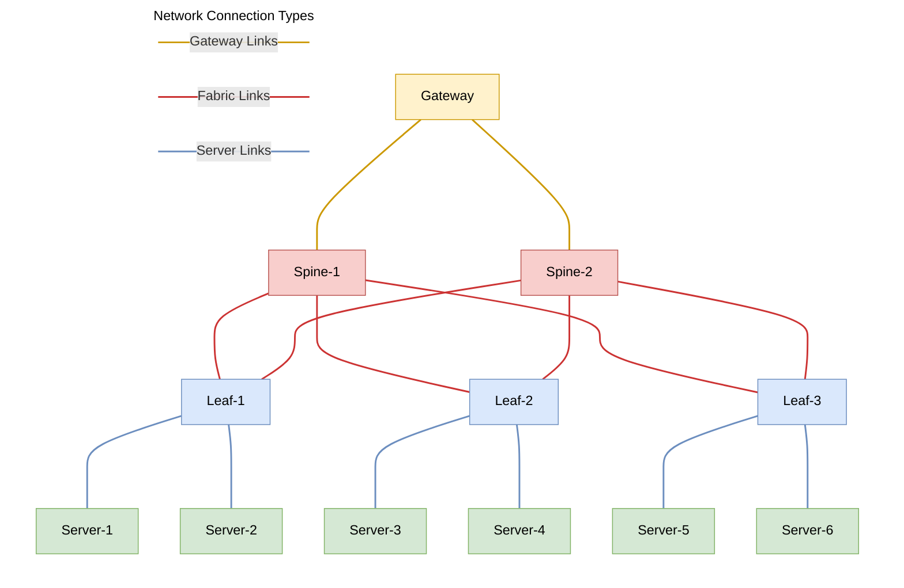

# Gateway overview

The Gateway adds advanced network service capabilities to the fabric,
complementing its fast, scalable connectivity. The fabric delivers efficient,
cut-through transport between workloads, while the Gateway provides additional
capabilities such as NAT, PAT, and firewalling. Simple [VPC Peerings](vpcs.md#vpcpeering) use the
full bandwidth of the fabric, whereas traffic using Gateway services is
handled through the Gateway nodes, which determine the available throughput.
Together, they offer both high-performance connectivity and rich network services.

## Gateway Nodes and Fabric Connectivity

Gateway nodes are connected to the fabric by a set of physical connections that are modeled via Connection objects.
See the section on [Gateway Connections](connections.md#gateway-connections) for connection requirements and example configuration.

When a Gateway Peering is used to connect two VPCs or externals, the gateway nodes attract traffic to themselves by advertising the appropriate routes to the fabric.
In turn, the fabric uses these routes to steer traffic to the gateway so that
the gateway can apply the configured peering policy.

Gateway nodes use BGP to advertise routes to the fabric, and the gateway gets its own ASN so it is possible to easily identify gateway-advertised routes in the fabric.

```mermaid
graph TD

%% Style definitions
classDef gateway fill:#FFF2CC,stroke:#CC9900,stroke-width:1px,color:#000
classDef spine   fill:#F8CECC,stroke:#B85450,stroke-width:1px,color:#000
classDef leaf    fill:#DAE8FC,stroke:#6C8EBF,stroke-width:1px,color:#000
classDef server  fill:#D5E8D4,stroke:#82B366,stroke-width:1px,color:#000
classDef hidden fill:none,stroke:none
classDef legendBox fill:none,stroke:none,color:#000

%% Network diagram

Gateway_01["Gateway"]

subgraph Spines[" "]
    Spine_01["Spine-1"]
    Spine_02["Spine-2"]
end

subgraph Leaves[" "]
    Leaf_01["Leaf-1"]
    Leaf_02["Leaf-2"]
    Leaf_03["Leaf-3"]
end

subgraph Servers[" "]
    Server_01["Server-1"]
    Server_02["Server-2"]
    Server_03["Server-3"]
    Server_04["Server-4"]
    Server_05["Server-5"]
    Server_06["Server-6"]
end

%% Connections

%% Gateway_01 -> Spines
Gateway_01 --- Spine_01
Gateway_01 --- Spine_02

Spine_01 --- Leaf_01
Spine_01 --- Leaf_02
Spine_01 --- Leaf_03
Spine_02 --- Leaf_01
Spine_02 --- Leaf_02
Spine_02 --- Leaf_03

%% Leaves -> Servers
Leaf_01 --- Server_01
Leaf_01 --- Server_02
Leaf_02 --- Server_03
Leaf_02 --- Server_04
Leaf_03 --- Server_05
Leaf_03 --- Server_06

subgraph Legend["Network Connection Types"]
    direction LR
    %% Create invisible nodes for the start and end of each line
    L1(( )) --- |"Gateway Links"| L2(( ))
    L7(( )) --- |"Fabric Links"| L8(( ))
    L9(( )) --- |"Server Links"| L10(( ))
end

class Gateway_01 gateway
class Spine_01,Spine_02 spine
class Leaf_01,Leaf_02,Leaf_03 leaf
class Server_06,Server_05,Server_04,Server_03,Server_02,Server_01 server
class L1,L2,L7,L8,L9,L10 hidden
class Legend legendBox
linkStyle default stroke:#666,stroke-width:2px
linkStyle 0,1 stroke:#CC9900,stroke-width:2px
linkStyle 2,3,4,5,6,7 stroke:#CC3333,stroke-width:2px
linkStyle 8,9,10,11,12,13 stroke:#6C8EBF,stroke-width:2px
linkStyle 14 stroke:#CC9900,stroke-width:2px
linkStyle 15 stroke:#CC3333,stroke-width:2px
linkStyle 16 stroke:#6C8EBF,stroke-width:2px

%% Make subgraph containers invisible
style Spines fill:none,stroke:none
style Leaves fill:none,stroke:none
style Servers fill:none,stroke:none
```

## Stateful Processing

The gateway is a stateful device. When stateful NAT (masquerade or
port-forwarding) is configured on a gateway peering, the gateway maintains a
**flow table** in which each active connection is associated to an entry
recording the NAT translation applied and the connection's idle timer.

The flow table can handle millions of concurrent entries depending on the
gateway node's available memory. The maximum number of flow entries can be
configured via the `flowTableCapacity` field in the Gateway spec. In most
deployments, the default is sufficient.

Each gateway maintains its own flow table independently; flow state is not
shared between gateways. If a gateway fails and traffic is redirected to a
backup gateway (see [Gateway fail-over](gateway-failover.md)), existing
stateful connections must be re-established, as the backup gateway has no
knowledge of the failed gateway's flow table.

Flow entries expire after a configurable period of inactivity. For the
per-peering idle timeouts that govern entries eviction, see
[Flow Table](gateway-peering.md#flow-table).

## Gateway Peering

Just as [VPC Peerings](vpcs.md#vpcpeering) provide VPC-to-VPC connectivity by way of the switches in the fabric, gateway peerings provide connectivity via the gateway nodes.
Gateway services can be inserted between a pair of VPCs or a VPC and an external using a Gateway Peering.
Each peering can be configured to provide the necessary services for traffic
that uses that peering.

See [Gateway Peering](gateway-peering.md) for the configuration of peerings,
including static and stateful NAT, peering with externals, and external
connectivity examples.

See [Gateway Peering ACLs](gateway-acls.md) for restricting the traffic that a
peering admits.
