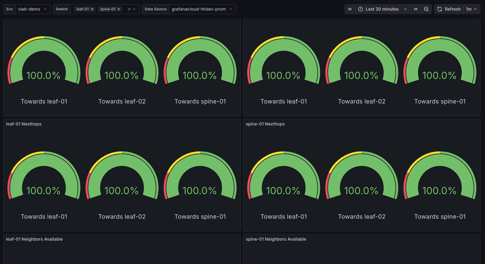

# Grafana Dashboards

To provide monitoring for most critical metrics from the switches managed by Hedgehog Fabric there are several Dashboards that may be used in Grafana deployments. Make sure that you've enabled metrics and logs collection for the switches in the Fabric that is
described in [Fabric Config](../install-upgrade/config.md#telemetry) section.

## Variables
List of common variables used in Hedgehog Grafana dashboards

- **env** (Label: Env): `label_values(env)` - Environment to monitor
- **node** (Label: Switch): `label_values(hostname)` - Switch Name
- **vrf** (Label: VRF): `label_values(vrf)` - VRF name (Multi-value)
- **neighbor** (Label: Neighbor): `label_values(neighbor)` - BGP Neighbor IP address(Multi-value)
- **interface** (Label: Interface): `label_values(interface)` - Switch Interface name as defined in wiring (Multi-value)
- **file** (Label: File): `label_valuse(filename)` - Name of Logs file to inspect (Loki)
- **datasource** (Label: Data Source)" `prometheus` - Data source for dashboard
  queries, alternatively `loki` for logging.

## Switch Critical Resources

 

This table reports usage and capacity of ASIC's programmable resources 
such as:

- Access control lists
- IPv4 Routes
- IPv4 Nexthops
- IPv4 Neighbors
- IP Multicast  Entries
- MAC Forwarding Database

[Critical Resource Stats JSON](./boards/grafana_crm.json)

## Fabric

 

Fabric underlay and external peering monitoring. Including reporing for:

- BGP Neighbors
- BGP Session state
- Number of BGP Updates and Prefixes sent/received for each BGP Neighbor
- Keepalive counters

[Fabric Dashboard JSON](./boards/grafana_fabric.json)

## Interfaces

 

Switch interfaces monitoring visualization that includes:

- Interface Oper/Admin state
- Total input/output packets counter
- Input/output PPS/Bits rate
- Interface utilization
- Counters for Unicast/Broadcast/Multicast packets
- Errors and discards counters

[Switch Interface Dashboard JSON](./boards/grafana_interfaces.json)

## Logs

System and fabric logs:

- Kernel and BGP logs from Syslog
- Errors in agent and syslog
- Full output of defined file

[Logs Dashboard JSON](./boards/grafana_logs.json)

## Platform

 

Information from PSU, temperature sensors and fan trays:

- Input/output PSU voltage
- Fan speed
- Temperature from switch sensors (CPU, PSU, etc)
- For transceivers with DOM - optic sensor temperature

[Platform Dashboard JSON](./boards/grafana_platform.json)

## Fabric Agent Stats

Information from the Agent about heartbeats and configuration generation.

[Fabric Agent Dashboard JSON](./boards/grafana_fabric_agent_stats.json)

## Node Exporter

 

[Grafana Node Exporter Full](https://grafana.com/grafana/dashboards/1860-node-exporter-full/) is an opensource Grafana board that provide
visualizations for monitoring Linux nodes. In particular case Node Exporter is used to track SONiC OS own stats such as

- Memory/disks usage
- CPU/System utilization
- Networking stats (traffic that hits SONiC interfaces)
...

[Node Exporter Dashboard JSON](./boards/grafana_node_exporter.json)

