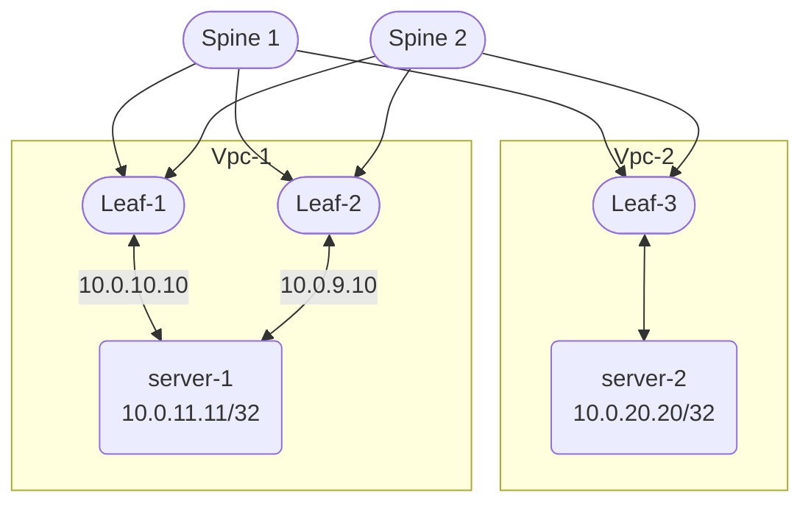

# Host Settings

This page contains settings for Linux servers, these instructions are agnostic of the Linux
distribution used by the servers. The commands use the `ip` utility from the `iproute2` package.
These settings **do not persist across reboots**. Consult the documentation from
the Linux distribution for guides on how to persist the settings used on the
server. For example, [Netplan][netplan] or [Network Manager][nmanager]. For
additional details on options and behavior, consult the [kernel bonding driver][bonding] documentation.

[nmanager]: https://networkmanager.dev/docs/admins/
[netplan]: https://documentation.ubuntu.com/server/explanation/networking/configuring-networks/index.html

## MCLAG / ESLAG

The multi-chassis LAG architecture is a way to provide device redundancy
in a network architecture. At the physical layer, an MCLAG topology is a single
server connected to two different switches and, those switches are directly connected
to each other in addition to being connected to the rest of the fabric.

ESLAG is a similar technology to MCLAG, with the beneficial difference that the
switches do not need to be directly connected to each other. There can be up to 4
switches in an ESLAG group, whereas MCLAG is always two switches.

Regardless of whether MCLAG or ESLAG is chosen, the host must configure its two
(or more) ports using LACP (IEEE 802.3ad).

### Server Settings

The supported server-side setting for bonding is `802.3ad`, with hashing policy
`layer2` or `layer2+3`. `layer2+3` transmit hashing is the recommended
setting for the overwhelming majority of scenarios. 
To configure this in Linux:

``` bash
sudo ip link add $bond_name type bond miimon 50 mode 802.3ad layer2+3
sudo ip link set $slave1_name master $bond_name
sudo ip link set $slave2_name master $bond_name
```

The `miimon 100` indicates that the bonding driver will use `miimon` to
determine if the link is `up`, and it will poll every 50 milliseconds.

`layer2` or `layer2+3` is the hashing mode, which controls the input into the
hash function. See the [kernel bonding driver][bonding] documentation for 
additional details.

After the bond has been created, it can receive a DHCP address or be
statically assigned, for example:

```bash
sudo ip addr add 10.30.10.10/24 dev bond0
```

To check the status of this bond:

```bash
cat /proc/net/bonding/bond0
```


## LAG, Bonding, Teaming, Bundling

A LAG configuration can be used to increase the bandwidth to and from an end
host. For example, if a server has two 25 Gbps ports, the ports can be bonded so
they will have an aggregate 50 Gbps of available bandwidth. At the physical
layer, two cables are going from the server to a single switch.

To enable fast detection of faults, `802.3ad` is the supported mode for bonds
attaching to the Open Network Fabric. The steps to configure the bond are the
same as the [above server settings](#server-settings)

The kernel bonding driver documentation discusses other modes for bonding. 
Several of those modes don't require cooperation on the switch side, so there 
is no fabric configuration needed. The primary concerns for using these modes 
are out-of-order TCP delivery, fault detection, and correction time.

## Active / Passive Fault Tolerance

Some networking equipment doesn't support MCLAG or ESLAG. In this case, to
enable fault-tolerant availability, configure a bond on the Linux server in
active / standby mode. In this topology, a link is connected from
server-1 to switch-1, and another link is connected from server-1 to switch-2.
There is neither [MCLAG connection](connections.md#mclag) nor [switch
group](devices.md#redundancy-groups) configuration applied to the
switches. When adding these links to the fabric via the `kubectl` command or
the wiring diagram, use the [unbundled](connections.md#unbundled) connection
kind.

### Active / Passive Bond Settings

The IP addresses used in the following commands are examples. On the host:

1. Create a bond: 

``` bash
sudo ip link add bond0 type bond mode active-backup miimon 50 num_grat_arp 5 primary enp2s1
```
2. Add the member interfaces to the bond:

``` bash
sudo ip link set link enp2s1 master bond0
sudo ip link set link enp2s2 master bond0
```
3. Add an address to the bond:

``` bash
sudo ip addr add 10.30.10.10/24 dev bond0
```
4. Make the bond  the default route:

```bash
sudo ip route add default via 10.30.10.1
```

Print the link layer information for the interfaces to see that the same MAC
address is on all 3 interfaces: bond0, enp2s1,enp2s2:

``` console 
core@server-1 ~ $ ip link
1: lo: <LOOPBACK,UP,LOWER_UP> mtu 65536 qdisc noqueue state UNKNOWN mode DEFAULT group default qlen 1000
    link/loopback 00:00:00:00:00:00 brd 00:00:00:00:00:00
2: enp2s1: <BROADCAST,MULTICAST,SLAVE,UP,LOWER_UP> mtu 1500 qdisc mq master bond0 state UP mode DEFAULT group default qlen 1000
    link/ether a6:eb:64:de:95:92 brd ff:ff:ff:ff:ff:ff permaddr a0:36:9f:3f:1a:e8
3: enp2s2: <BROADCAST,MULTICAST,SLAVE,UP,LOWER_UP> mtu 1500 qdisc mq master bond0 state UP mode DEFAULT group default qlen 1000
    link/ether a6:eb:64:de:95:92 brd ff:ff:ff:ff:ff:ff permaddr 14:02:ec:7f:3a:3c
4: enp2s0: <BROADCAST,MULTICAST,UP,LOWER_UP> mtu 1500 qdisc pfifo_fast state UP mode DEFAULT group default qlen 1000
    link/ether 0c:20:12:fe:01:00 brd ff:ff:ff:ff:ff:ff
10: bond0: <BROADCAST,MULTICAST,MASTER,UP,LOWER_UP> mtu 1500 qdisc noqueue state UP mode DEFAULT group default qlen 1000
    link/ether a6:eb:64:de:95:92 brd ff:ff:ff:ff:ff:ff
13: bond0: <BROADCAST,MULTICAST,UP,LOWER_UP> mtu 1500 qdisc noqueue state UP mode DEFAULT group default qlen 1000
    link/ether a6:eb:64:de:95:92 brd ff:ff:ff:ff:ff:ff
```

Confirm that the bonding driver is reporting the selected primary interface:

```console
core@server-1 ~ $ cat /proc/net/bonding/bond0

Ethernet Channel Bonding Driver: v6.6.74-flatcar

Bonding Mode: fault-tolerance (active-backup)
Primary Slave: enp2s1 (primary_reselect always)
Currently Active Slave: enp2s1
MII Status: up
MII Polling Interval (ms): 50
Up Delay (ms): 0
Down Delay (ms): 0
Peer Notification Delay (ms): 0

Slave Interface: enp2s1
MII Status: up
Speed: 10000 Mbps
Duplex: full
Link Failure Count: 0
Permanent HW addr: a0:36:9f:3f:1a:e8
Slave queue ID: 0

Slave Interface: enp2s2
MII Status: up
Speed: 10000 Mbps
Duplex: full
Link Failure Count: 0
Permanent HW addr: 14:02:ec:7f:3a:3c
Slave queue ID: 0
```

### Failure Scenarios
When `miimon` detects that the primary member interface is no longer `up`, the bonding
driver will send five gratuitous ARP messages via the secondary member interface to notify the switch
that the IP address is now on a new switch. The fabric will start routing
traffic to this location, and the host will start receiving traffic.

If the `miimon` polling determines that the primary member interface link is
`up`, then the bonding driver will switch back to the primary member interface. 
The `primary_reselect` behavior is configurable, see the [kernel bonding driver][bonding] documentation
 for additional details.

The changeover process will result in dropped packets, but it should not result
in TCP timeouts. 

## VLANs

A Linux host is capable of receiving tagged and untagged traffic. Tagged
traffic is traffic that has the VLAN (802.1q) header intact, untagged traffic
has the VLAN header removed as it exits the switch.

The Open Network Fabric is capable of emitting tagged and untagged traffic. The
setting to change whether traffic is tagged or untagged is on the
[VPCAttahcment](vpcs.md#vpcattachment), specifically the `nativeVLAN` field.
The default value of this field is `false`, meaning the fabric will emit tagged
traffic. If a port emits tagged traffic, it means that the Linux host must handle 
the tag. This is accomplished by creating a link layer interface on the host for the tag:

```bash
sudo ip link add link enp2s1 name enp2s1.1001 type vlan id 1001
```
The name `enp2s1.1001` is by convention; it can be customized. The `vlan` in
this example is `1001` and was created when the subnet was created inside the
[VPC](vpcs.md#vpc). 

When the `nativeVLAN` field is `true`, the switch will remove the 802.1q tag
from the packet as it exits the switch. When a Linux server is attached to this
port, there is no need to create an additional link layer device.

### Multiple VLANs on a port

At times, it is desirable to configure a single port that emits more than one
VLAN tag, which is called VLAN trunking. To create a trunk port, attach the VPC
subnet to the  desired port, multiple VPC subnets can be connected to a single
connection object:

```bash
kubectl fabric vpc attach --vpc-subnet vpc-1/default --connection server-1--leaf-1
kubectl fabric vpc attach --vpc-subnet vpc-2/default --connection server-1--leaf-1
```

[bonding]: https://www.kernel.org/doc/html/latest/networking/bonding.html

## Layer 3 Multi-Homing

Hosts can be multi-homed at the network layer by configuring a virtual IP address (VIP) on the host. After the
virtual IP address is configured, services will bind to the VIP and be
available via multiple routes. Vpc-2 is shown in this example as partner in ICMP
traffic. The diagram illustrates the topology used for this setup:



### VPC Settings
The VPC needs one subnet per link to the host and an additional subnet to hold
the VIP. The IP addresses used in the following YAML file are examples, and can
be adapted to any environment. The configuration for the VPC holding the VIP is:

```{yaml annotate title='vip-vpc.yaml' linenums='1'}
apiVersion: vpc.githedgehog.com/v1beta1
kind: VPC
metadata:
  name: vpc-1
  namespace: default
spec:
  ipv4Namespace: default
  subnets:
    link1:
      dhcp:
        enable: false # optinal, can be true
      gateway: 10.0.10.1
      subnet: 10.0.10.0/24
      vlan: 1010
    link2:
      dhcp:
        enable: false # optinal, can be true
      gateway: 10.0.9.1
      subnet: 10.0.9.0/24
      vlan: 1009
    vip:
      dhcp:
        enable: false # must be false
      gateway: 10.0.11.1
      subnet: 10.0.11.0/24
      vlan: 1011
  vlanNamespace: default
```

#### Multiple Subnets inside of a VPC
The above listing has three subnets for a single VPC. The subnets are: link1,
link2, and vip. Each subnet has its own VLAN.

#### Attach Subnets to Connections
The fabric needs to know which connections to attach to `vpc-1`.

```bash
kubectl fabric vpc attach --vpc-subnet vpc-1/link1 --connection server-1--unbundled--leaf-01
kubectl fabric vpc attach --vpc-subnet vpc-1/link2 --connection server-1--unbundled--leaf-02
kubectl fabric vpc attach --vpc-subnet vpc-1/vip --connection server-1--unbundled--leaf-01 --nativeVLAN true
kubectl fabric vpc attach --vpc-subnet vpc-1/vip --connection server-1--unbundled--leaf-02 --nativeVLAN true
```

The attachments are done so that routes to the VIP will be distributed via the
fabric to any VPCs that peer with `vpc-1`.

#####  The nativeVLAN setting

The VIP attachments should not use tagged traffic, ensure to pass `--nativeVLAN
true` to the kubectl command. Alternatively edit the object after its created
and set: `nativeVLAN: true` in the object.

### Host Settings

In this example the host has two interfaces to the network. The interfaces are
attached to switch ports that are emitting tagged traffic, and are the default
routes for the host. A dummy interface is used to hold the VIP, but the address
could also be applied to the `lo` device.

#### Create the Interfaces

```bash
sudo ip link add link enp2s2 name enp2s2.1010 type vlan id 1010
sudo ip link add link enp2s1 name enp2s1.1009 type vlan id 1009
sudo ip link add loop type dummy
```

#### IP addresses for interfaces 

```bash
sudo ip addr add 10.0.10.10/24 dev enp2s2.1010
sudo ip addr add 10.0.9.10/24 dev enp2s2.1009
sudo ip addr add 10.0.11.11/32 dev loop
```

#### Configure the ECMP Default Route

This command creates two default routes of equal weight.

```bash
sudo ip route replace default proto static scope global\
    nexthop dev enp2s1.1009 via 10.0.9.1 weight 1\
    nexthop dev enp2s2.1010 via 10.0.10.1 weight 1
```

#### Configure the Sysctl

Ensure that sysctls that begin with `fib_` are according to the needs of the
environment. The relevant sysctl settings are `fib_` in the [linux kernel
documentation](https://www.kernel.org/doc/html/latest/networking/ip-sysctl.html).
Special attention should be given to `fib_multipath_use_neigh`. If this is set
`0` packets will be emitted out an interface even if down, resulting in lost
packets.

