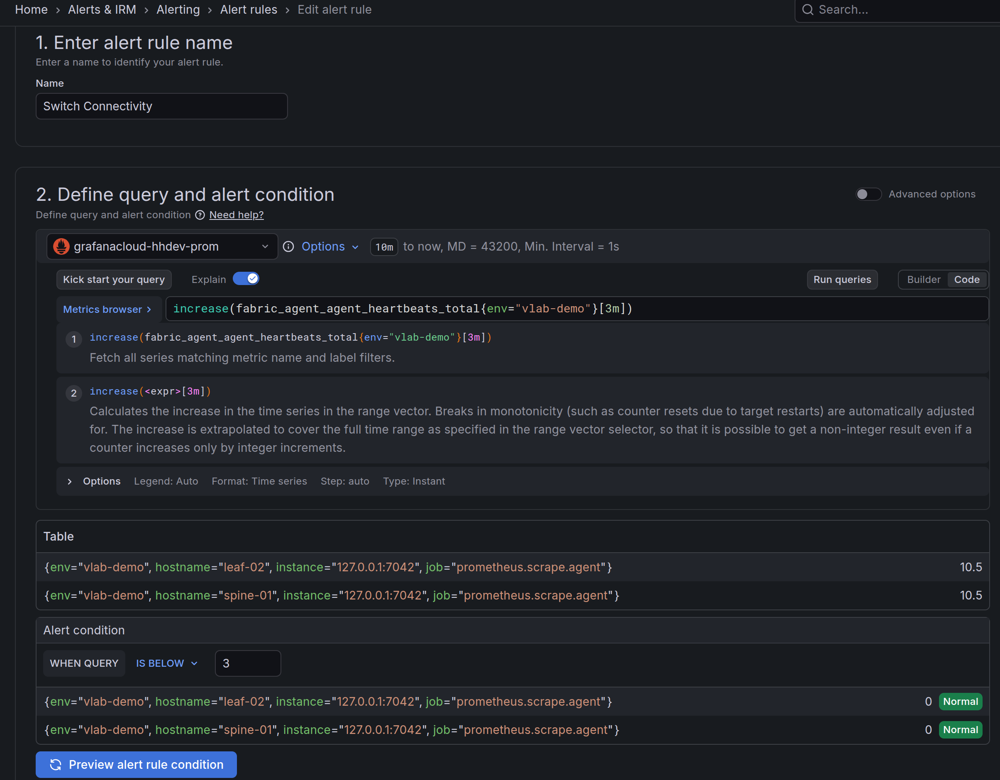

# Configuration

## Overview
There is an option to enable [Grafana
Alloy](https://grafana.com/docs/alloy/latest/) on all switches to forward metrics and logs to the configured targets using
[Prometheus Remote-Write
API](https://prometheus.io/docs/specs/prw/remote_write_spec/) and Loki API. Metrics includes port speeds, counters,
errors, operational status, transceivers, fans, power supplies, temperature
sensors, BGP neighbors, LLDP neighbors, and more. Logs include Hedgehog agent
logs, switch syslog, pod logs for all services running in the control node k8s cluster. Modify the URL as needed, instead of `/api/v1/push` it could be
`/api/v1/write`; check the documentation for the data provider.

Switches push telemetry data through a proxy running in a pod on the control
node. Switches do not have direct access to the Internet. Configure the control node to be able to reach and resolve the location
of the Prometheus and Loki servers.

Telemetry can be enabled after installation of the fabric. There are two YAML
objects that control the telemetry configuration. The first YAML object
configures the credentials and  URL for the collectors. The second configures
which metrics are sent via Grafana Alloy.

## Grafana Cloud Configuration

### Tokens

Grafana Cloud manages read and write permissions with policies. In order to
send metrics to the prometheus or loki a policy for your realm needs to be created.
When creating the policy ensure that it has at least `logs:write` and `metrics:write` permission
selected. After the policy is created, create a token under that policy. Ensure that
the token is appropriately named and time limited. Depending on your
environment separate tokens for log writing and metric writing might be
advisable. For additional details see the
[documentation](https://grafana.com/docs/grafana-cloud/security-and-account-management/authentication-and-permissions/access-policies/)


## Billing

Users are advised to use the regular expressions to limit the amount of data
sent to grafana cloud as the costs compound quickly.

## Add Credentials

Take the tokens created on grafana cloud and populate them in this YAML file. The username
is different between prometheus and loki.
Apply the setting below for telemetry to be pushed to the specified Prometheus and Loki instances:

```{ .yaml .annotate title="credentials.yaml" linenums="1" }
spec:
  config:
    observability:
      labels:
        env: hh-fabric # (1)!
      targets:
        loki:
          grafana_cloud: # (2)!
            basicAuth:
              password: "insert_password_or_token_here"
              username: "1234567"
            labels: 
              some: label # (3)!
            url: https://[your-loki-server].grafana.net/loki/api/v1/push
        prometheus:
          grafana_cloud: # (4)!
            basicAuth:
              password: "insert_password_or_token_here"
              username: "1234567"
            labels:
              some: label
            url: https://[your-prometheus-server].grafana.net/api/prom/push

```

1. Common label for all targets, "env" is a well-known label used in dashboards
2. Can be any name of your choosing
3. Extra labels applied to a specific target
4. Can be any name of your choosing

To apply these changes to the fabric use the following command:

``` shell
kubectl patch -n fab --type merge fabricator/default --patch-file credentials.yaml
```

## Gateway Observability

```{ .yaml .annotate title="gateway.yaml" linenums="1" }
spec:
  config:
    gateway:
      observability:
        dataplane:
          metrics: true
          metricsInterval: 60
        frr:
          metrics: true
          metricsInterval: 60
        unix: # (1)!
          metrics: true
          metricsCollectors: # (2)!
          - cpu
          - loadavg
          - meminfo
          - filesystem
          metricsInterval: 60
```


1. Alloy is configured to use the [prometheus.exporter.unix](https://grafana.com/docs/alloy/latest/reference/components/prometheus/prometheus.exporter.unix/) component
2. This lists the enabled [collectors](https://grafana.com/docs/alloy/latest/reference/components/prometheus/prometheus.exporter.unix/#collectors-list)

To apply these changes to the fabric use the following command:
``` shell
kubectl patch -n fab --type merge fabricator/default --patch-file gateway.yaml
```

## Fabric Observability
This example shows how to configure the collection of data from the fabric
switches.

```{ .yaml .annotate title="config.yaml" linenums="1" }
spec:
  config:
    fabric:
      observability:
        agent: # (1)!
          logs: true
          metrics: true
          metricsInterval: 60
          metricsRelabel: # (2)!
          - action: keep
            regex: .*(_in_bits|_status|_generation|_temperature|_transceiver).* # (3)!
            sourceLabels:
            - __name__
        unix: # (4)!
          metrics: true
          metricsCollectors: # (5)!
          - cpu
          - loadavg
          - meminfo
          - filesystem
          metricsInterval: 60
          metricsRelabel: # (6)!
          - action: keep
            regex: .*(_load).* # (7)!
            sourceLabels:
            - __name__
          syslog: true
```

1. The Hedgehog agent generates information from the ASIC ports and switch
   configuration
2. This option mirrors the [prometheus.relabel](https://grafana.com/docs/alloy/latest/reference/components/prometheus/prometheus.relabel) component
3. This is a regular expression over all the metric names that come from prometheus
4. Alloy is configured to use the [prometheus.exporter.unix](https://grafana.com/docs/alloy/latest/reference/components/prometheus/prometheus.exporter.unix/) component
5. This lists the enabled [collectors](https://grafana.com/docs/alloy/latest/reference/components/prometheus/prometheus.exporter.unix/#collectors-list)
6. This option mirrors the [prometheus.relabel](https://grafana.com/docs/alloy/latest/reference/components/prometheus/prometheus.relabel/) component
7. Regular expression over the metric names that come the metricsCollectors

To apply these changes to the fabric use the following command:

``` shell
kubectl patch -n fab --type merge fabricator/default --patch-file config.yaml
```
Users are encouraged to read the [Grafana Alloy
Docs](https://grafana.com/docs/grafana-cloud/send-data/alloy/tutorials/logs-and-relabeling-basics/)
on relabeling to ensure the desired metrics are selected. By default all
metrics are sent to the collectors.


## Alerting



The alert rule queries the increase of the
`fabric_agent_agent_heartbeats_total` metric. In normal operation the switch agent sends two
increments every minute. The [prometheus
`increase`](https://prometheus.io/docs/prometheus/latest/querying/functions/#increase) function will extrapolate
the value for the total time range which leads to a higher reported number
than is actually observed, this is not a concern. Select a value for the Alert
condition according to your operational needs. The example has a value of 3,
which allows for some delays and drops before firing the alarm.

For convenience [here is the JSON](./boards/grafana_alarm.json) used to
configure this alarm. Values that should be changed to match your environment
contain the string "Hedgehog".

Grafana has a [learning
journey](https://grafana.com/docs/learning-journeys/logs-alert-creation/) to
assist users in creating and configuring alerts.
