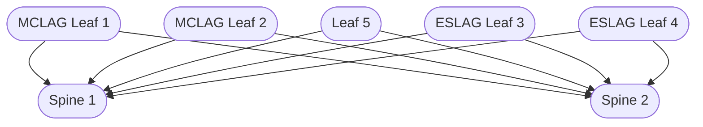
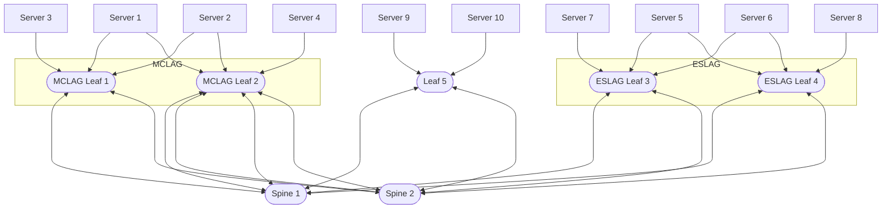

# Demo on VLAB

## Goals

The goal of this demo is to show how to use VPCs, attach and peer them and run test connectivity between the servers.
Examples are based on the default VLAB topology.

You can find instructions on how to setup VLAB in the [Overview](overview.md) and [Running VLAB](running.md) sections.

## Default topology

The default topology is Spine-Leaf with 2 spines, 2 MCLAG leaves, 2 ESLAG leaves and 1 non-MCLAG leaf. Optionally, you can choose to run
the default Collapsed Core topology using flag `--fabric-mode collapsed-core` (or `-m collapsed-core`) which only
consists of 2 switches.

For more details on customizing topologies see the [Running VLAB](running.md) section.

In the default topology, the following Control Node and Switch VMs are created, the Control Node is connected to every switch, the lines are ommitted for clarity:



As well as the following test servers, as above Control Node connections are omitted:



## Manual VPC creation
### Creating and attaching VPCs

You can create and attach VPCs to the VMs using the `kubectl fabric vpc` command on the Control Node or outside of the
cluster using the kubeconfig. For example, run the following commands to create 2 VPCs with a single subnet each, a DHCP
server enabled with its optional IP address range start defined, and to attach them to some of the test servers:

```console
core@control-1 ~ $ kubectl get conn | grep server
server-01--mclag--leaf-01--leaf-02   mclag          5h13m
server-02--mclag--leaf-01--leaf-02   mclag          5h13m
server-03--unbundled--leaf-01        unbundled      5h13m
server-04--bundled--leaf-02          bundled        5h13m
server-05--unbundled--leaf-03        unbundled      5h13m
server-06--bundled--leaf-03          bundled        5h13m

core@control-1 ~ $ kubectl fabric vpc create --name vpc-1 --subnet 10.0.1.0/24 --vlan 1001 --dhcp --dhcp-start 10.0.1.10
06:48:46 INF VPC created name=vpc-1

core@control-1 ~ $ kubectl fabric vpc create --name vpc-2 --subnet 10.0.2.0/24 --vlan 1002 --dhcp --dhcp-start 10.0.2.10
06:49:04 INF VPC created name=vpc-2

core@control-1 ~ $ kubectl fabric vpc attach --vpc-subnet vpc-1/default --connection server-01--mclag--leaf-01--leaf-02
06:49:24 INF VPCAttachment created name=vpc-1--default--server-01--mclag--leaf-01--leaf-02

core@control-1 ~ $ kubectl fabric vpc attach --vpc-subnet vpc-2/default --connection server-02--mclag--leaf-01--leaf-02
06:49:34 INF VPCAttachment created name=vpc-2--default--server-02--mclag--leaf-01--leaf-02
```

The VPC subnet should belong to an IPv4Namespace, the default one in the VLAB is `10.0.0.0/16`:

```console
core@control-1 ~ $ kubectl get ipns
NAME      SUBNETS           AGE
default   ["10.0.0.0/16"]   5h14m
```

After you created the VPCs and VPCAttachments, you can check the status of the agents to make sure that the requested
configuration was applied to the switches:

```console
core@control-1 ~ $ kubectl get agents
NAME       ROLE          DESCR           APPLIED   APPLIEDG   CURRENTG   VERSION
leaf-01    server-leaf   VS-01 MCLAG 1   2m2s      5          5          v0.23.0
leaf-02    server-leaf   VS-02 MCLAG 1   2m2s      4          4          v0.23.0
leaf-03    server-leaf   VS-03           112s      5          5          v0.23.0
spine-01   spine         VS-04           16m       3          3          v0.23.0
spine-02   spine         VS-05           18m       4          4          v0.23.0
```

In this example, the values in columns `APPLIEDG` and `CURRENTG` are equal which means that the requested configuration
has been applied.

### Setting up networking on test servers

You can use `hhfab vlab ssh` on the host to SSH into the test servers and configure networking there. For example, for
both `server-01` (MCLAG attached to both `leaf-01` and `leaf-02`) we need to configure a bond with a VLAN on top of it
and for the `server-05` (single-homed unbundled attached to `leaf-03`) we need to configure just a VLAN and they both
will get an IP address from the DHCP server. You can use the `ip` command to configure networking on the servers or use
the little helper pre-installed by Fabricator on test servers, `hhnet`.

For `server-01`:

```console
core@server-01 ~ $ hhnet cleanup
core@server-01 ~ $ hhnet bond 1001 enp2s1 enp2s2
10.0.1.10/24
core@server-01 ~ $ ip a
...
3: enp2s1: <BROADCAST,MULTICAST,SLAVE,UP,LOWER_UP> mtu 1500 qdisc pfifo_fast master bond0 state UP group default qlen 1000
    link/ether 06:5a:e8:38:3b:ea brd ff:ff:ff:ff:ff:ff permaddr 0c:20:12:fe:01:01
4: enp2s2: <BROADCAST,MULTICAST,SLAVE,UP,LOWER_UP> mtu 1500 qdisc pfifo_fast master bond0 state UP group default qlen 1000
    link/ether 06:5a:e8:38:3b:ea brd ff:ff:ff:ff:ff:ff permaddr 0c:20:12:fe:01:02
6: bond0: <BROADCAST,MULTICAST,MASTER,UP,LOWER_UP> mtu 1500 qdisc noqueue state UP group default qlen 1000
    link/ether 06:5a:e8:38:3b:ea brd ff:ff:ff:ff:ff:ff
    inet6 fe80::45a:e8ff:fe38:3bea/64 scope link
       valid_lft forever preferred_lft forever
7: bond0.1001@bond0: <BROADCAST,MULTICAST,UP,LOWER_UP> mtu 1500 qdisc noqueue state UP group default qlen 1000
    link/ether 06:5a:e8:38:3b:ea brd ff:ff:ff:ff:ff:ff
    inet 10.0.1.10/24 metric 1024 brd 10.0.1.255 scope global dynamic bond0.1001
       valid_lft 86396sec preferred_lft 86396sec
    inet6 fe80::45a:e8ff:fe38:3bea/64 scope link
       valid_lft forever preferred_lft forever
```

And for `server-02`:

```console
core@server-02 ~ $ hhnet cleanup
core@server-02 ~ $ hhnet bond 1002 enp2s1 enp2s2
10.0.2.10/24
core@server-02 ~ $ ip a
...
3: enp2s1: <BROADCAST,MULTICAST,SLAVE,UP,LOWER_UP> mtu 1500 qdisc pfifo_fast master bond0 state UP group default qlen 1000
    link/ether 5e:10:b1:f7:d0:4c brd ff:ff:ff:ff:ff:ff permaddr 0c:20:12:fe:02:01
4: enp2s2: <BROADCAST,MULTICAST,SLAVE,UP,LOWER_UP> mtu 1500 qdisc pfifo_fast master bond0 state UP group default qlen 1000
    link/ether 5e:10:b1:f7:d0:4c brd ff:ff:ff:ff:ff:ff permaddr 0c:20:12:fe:02:02
8: bond0: <BROADCAST,MULTICAST,MASTER,UP,LOWER_UP> mtu 1500 qdisc noqueue state UP group default qlen 1000
    link/ether 5e:10:b1:f7:d0:4c brd ff:ff:ff:ff:ff:ff
    inet6 fe80::5c10:b1ff:fef7:d04c/64 scope link
       valid_lft forever preferred_lft forever
9: bond0.1002@bond0: <BROADCAST,MULTICAST,UP,LOWER_UP> mtu 1500 qdisc noqueue state UP group default qlen 1000
    link/ether 5e:10:b1:f7:d0:4c brd ff:ff:ff:ff:ff:ff
    inet 10.0.2.10/24 metric 1024 brd 10.0.2.255 scope global dynamic bond0.1002
       valid_lft 86185sec preferred_lft 86185sec
    inet6 fe80::5c10:b1ff:fef7:d04c/64 scope link
       valid_lft forever preferred_lft forever
```

### Testing connectivity before peering

You can test connectivity between the servers before peering the switches using the `ping` command:

```console
core@server-01 ~ $ ping 10.0.2.10
PING 10.0.2.10 (10.0.2.10) 56(84) bytes of data.
From 10.0.1.1 icmp_seq=1 Destination Net Unreachable
From 10.0.1.1 icmp_seq=2 Destination Net Unreachable
From 10.0.1.1 icmp_seq=3 Destination Net Unreachable
^C
--- 10.0.2.10 ping statistics ---
3 packets transmitted, 0 received, +3 errors, 100% packet loss, time 2003ms
```

```console
core@server-02 ~ $ ping 10.0.1.10
PING 10.0.1.10 (10.0.1.10) 56(84) bytes of data.
From 10.0.2.1 icmp_seq=1 Destination Net Unreachable
From 10.0.2.1 icmp_seq=2 Destination Net Unreachable
From 10.0.2.1 icmp_seq=3 Destination Net Unreachable
^C
--- 10.0.1.10 ping statistics ---
3 packets transmitted, 0 received, +3 errors, 100% packet loss, time 2004ms
```

### Peering VPCs and testing connectivity

To enable connectivity between the VPCs, peer them using `kubectl fabric vpc peer`:

```console
core@control-1 ~ $ kubectl fabric vpc peer --vpc vpc-1 --vpc vpc-2
07:04:58 INF VPCPeering created name=vpc-1--vpc-2
```

Make sure to wait until the peering is applied to the switches using `kubectl get agents` command. After that, you can
test connectivity between the servers again:

```console
core@server-01 ~ $ ping 10.0.2.10
PING 10.0.2.10 (10.0.2.10) 56(84) bytes of data.
64 bytes from 10.0.2.10: icmp_seq=1 ttl=62 time=6.25 ms
64 bytes from 10.0.2.10: icmp_seq=2 ttl=62 time=7.60 ms
64 bytes from 10.0.2.10: icmp_seq=3 ttl=62 time=8.60 ms
^C
--- 10.0.2.10 ping statistics ---
3 packets transmitted, 3 received, 0% packet loss, time 2004ms
rtt min/avg/max/mdev = 6.245/7.481/8.601/0.965 ms
```

```console
core@server-02 ~ $ ping 10.0.1.10
PING 10.0.1.10 (10.0.1.10) 56(84) bytes of data.
64 bytes from 10.0.1.10: icmp_seq=1 ttl=62 time=5.44 ms
64 bytes from 10.0.1.10: icmp_seq=2 ttl=62 time=6.66 ms
64 bytes from 10.0.1.10: icmp_seq=3 ttl=62 time=4.49 ms
^C
--- 10.0.1.10 ping statistics ---
3 packets transmitted, 3 received, 0% packet loss, time 2004ms
rtt min/avg/max/mdev = 4.489/5.529/6.656/0.886 ms
```

If you delete the VPC peering with `kubectl delete` applied to the relevant object and wait for the agent to apply the
configuration on the switches, you can observe that connectivity is lost again:

```console
core@control-1 ~ $ kubectl delete vpcpeering/vpc-1--vpc-2
vpcpeering.vpc.githedgehog.com "vpc-1--vpc-2" deleted
```

```console
core@server-01 ~ $ ping 10.0.2.10
PING 10.0.2.10 (10.0.2.10) 56(84) bytes of data.
From 10.0.1.1 icmp_seq=1 Destination Net Unreachable
From 10.0.1.1 icmp_seq=2 Destination Net Unreachable
From 10.0.1.1 icmp_seq=3 Destination Net Unreachable
^C
--- 10.0.2.10 ping statistics ---
3 packets transmitted, 0 received, +3 errors, 100% packet loss, time 2004ms
```

!!! note ""
    You can see duplicate packets in the output of the `ping` command between some of the servers. This is expected
    behavior and is caused by the limitations in the VLAB environment.

    ```console
    core@server-01 ~ $ ping 10.0.5.10
    PING 10.0.5.10 (10.0.5.10) 56(84) bytes of data.
    64 bytes from 10.0.5.10: icmp_seq=1 ttl=62 time=9.58 ms
    64 bytes from 10.0.5.10: icmp_seq=1 ttl=62 time=9.58 ms (DUP!)
    64 bytes from 10.0.5.10: icmp_seq=2 ttl=62 time=6.99 ms
    64 bytes from 10.0.5.10: icmp_seq=2 ttl=62 time=6.99 ms (DUP!)
    64 bytes from 10.0.5.10: icmp_seq=3 ttl=62 time=9.59 ms
    64 bytes from 10.0.5.10: icmp_seq=3 ttl=62 time=9.60 ms (DUP!)
    ^C
    --- 10.0.5.10 ping statistics ---
    3 packets transmitted, 3 received, +3 duplicates, 0% packet loss, time 2003ms
    rtt min/avg/max/mdev = 6.987/8.720/9.595/1.226 ms
    ```
## Utility based VPC creation

### Setup VPCs
`hhfab vlab` includes a utility to create VPCs in vlab. This utility is a `hhfab vlab` sub-command. `hhfab vlab setup-vpcs`.

```console
NAME:
   hhfab vlab setup-vpcs - setup VPCs and VPCAttachments for all servers and configure networking on them

USAGE:
   hhfab vlab setup-vpcs [command options]

OPTIONS:
   --dns-servers value, --dns value [ --dns-servers value, --dns value ]    DNS servers for VPCs advertised by DHCP
   --force-clenup, -f                                                       start with removing all existing VPCs and VPCAttachments (default: false)
   --help, -h                                                               show help
   --interface-mtu value, --mtu value                                       interface MTU for VPCs advertised by DHCP (default: 0)
   --ipns value                                                             IPv4 namespace for VPCs (default: "default")
   --name value, -n value                                                   name of the VM or HW to access
   --servers-per-subnet value, --servers value                              number of servers per subnet (default: 1)
   --subnets-per-vpc value, --subnets value                                 number of subnets per VPC (default: 1)
   --time-servers value, --ntp value [ --time-servers value, --ntp value ]  Time servers for VPCs advertised by DHCP
   --vlanns value                                                           VLAN namespace for VPCs (default: "default")
   --wait-switches-ready, --wait                                            wait for switches to be ready before and after configuring VPCs and VPCAttachments (default: true)

   Global options:

   --brief, -b      brief output (only warn and error) (default: false) [$HHFAB_BRIEF]
   --cache-dir DIR  use cache dir DIR for caching downloaded files (default: "/home/ubuntu/.hhfab-cache") [$HHFAB_CACHE_DIR]
   --verbose, -v    verbose output (includes debug) (default: false) [$HHFAB_VERBOSE]
   --workdir PATH   run as if hhfab was started in PATH instead of the current working directory (default: "/home/ubuntu") [$HHFAB_WORK_DIR]
```

### Setup Peering
`hhfab vlab` includes a utility to create VPC peerings in VLAB. This utility is a `hhfab vlab` sub-command. `hhfab vlab setup-peerings`.

```console
NAME:
   hhfab vlab setup-peerings - setup VPC and External Peerings per requests (remove all if empty)

USAGE:
   Setup test scenario with VPC/External Peerings by specifying requests in the format described below.

   Example command:

   $ hhfab vlab setup-peerings 1+2 2+4:r=border 1~as5835 2~as5835:subnets=sub1,sub2:prefixes=0.0.0.0/0,22.22.22.0/24

   Which will produce:
   1. VPC peering between vpc-01 and vpc-02
   2. Remote VPC peering between vpc-02 and vpc-04 on switch group named border
   3. External peering for vpc-01 with External as5835 with default vpc subnet and any routes from external permitted
   4. External peering for vpc-02 with External as5835 with subnets sub1 and sub2 exposed from vpc-02 and default route
      from external permitted as well any route that belongs to 22.22.22.0/24

   VPC Peerings:

   1+2 -- VPC peering between vpc-01 and vpc-02
   demo-1+demo-2 -- VPC peering between demo-1 and demo-2
   1+2:r -- remote VPC peering between vpc-01 and vpc-02 on switch group if only one switch group is present
   1+2:r=border -- remote VPC peering between vpc-01 and vpc-02 on switch group named border
   1+2:remote=border -- same as above

   External Peerings:

   1~as5835 -- external peering for vpc-01 with External as5835
   1~ -- external peering for vpc-1 with external if only one external is present for ipv4 namespace of vpc-01, allowing
     default subnet and any route from external
   1~:subnets=default@prefixes=0.0.0.0/0 -- external peering for vpc-1 with auth external with default vpc subnet and
     default route from external permitted
   1~as5835:subnets=default,other:prefixes=0.0.0.0/0_le32_ge32,22.22.22.0/24 -- same but with more details
   1~as5835:s=default,other:p=0.0.0.0/0_le32_ge32,22.22.22.0/24 -- same as above

OPTIONS:
   --help, -h                     show help
   --name value, -n value         name of the VM or HW to access
   --wait-switches-ready, --wait  wait for switches to be ready before before and after configuring peerings (default: true)

   Global options:

   --brief, -b      brief output (only warn and error) (default: false) [$HHFAB_BRIEF]
   --cache-dir DIR  use cache dir DIR for caching downloaded files (default: "/home/ubuntu/.hhfab-cache") [$HHFAB_CACHE_DIR]
   --verbose, -v    verbose output (includes debug) (default: false) [$HHFAB_VERBOSE]
   --workdir PATH   run as if hhfab was started in PATH instead of the current working directory (default: "/home/ubuntu") [$HHFAB_WORK_DIR]
```

### Test Connectivity
`hhfab vlab` includes a utility to test connectivity between servers inside VLAB. This utility is a `hhfab vlab` sub-command. `hhfab vlab test-connectivity`.

```console
NAME:
   hhfab vlab test-connectivity - test connectivity between all servers

USAGE:
   hhfab vlab test-connectivity [command options]

OPTIONS:
   --curls value                  number of curl tests to run for each server to test external connectivity (0 to disable) (default: 3)
   --help, -h                     show help
   --iperfs value                 seconds of iperf3 test to run between each pair of reachable servers (0 to disable) (default: 10)
   --iperfs-speed value           minimum speed in Mbits/s for iperf3 test to consider successful (0 to not check speeds) (default: 7000)
   --name value, -n value         name of the VM or HW to access
   --pings value                  number of pings to send between each pair of servers (0 to disable) (default: 5)
   --wait-switches-ready, --wait  wait for switches to be ready before testing connectivity (default: true)

   Global options:

   --brief, -b      brief output (only warn and error) (default: false) [$HHFAB_BRIEF]
   --cache-dir DIR  use cache dir DIR for caching downloaded files (default: "/home/ubuntu/.hhfab-cache") [$HHFAB_CACHE_DIR]
   --verbose, -v    verbose output (includes debug) (default: false) [$HHFAB_VERBOSE]
   --workdir PATH   run as if hhfab was started in PATH instead of the current working directory (default: "/home/ubuntu") [$HHFAB_WORK_DIR]

```

## Using VPCs with overlapping subnets

First, create a second IPv4Namespace with the same subnet as the default one:

```console
core@control-1 ~ $ kubectl get ipns
NAME      SUBNETS           AGE
default   ["10.0.0.0/16"]   24m

core@control-1 ~ $ cat <<EOF > ipns-2.yaml
apiVersion: vpc.githedgehog.com/v1beta1
kind: IPv4Namespace
metadata:
  name: ipns-2
  namespace: default
spec:
  subnets:
  - 10.0.0.0/16
EOF

core@control-1 ~ $ kubectl apply -f ipns-2.yaml
ipv4namespace.vpc.githedgehog.com/ipns-2 created

core@control-1 ~ $ kubectl get ipns
NAME      SUBNETS           AGE
default   ["10.0.0.0/16"]   30m
ipns-2    ["10.0.0.0/16"]   8s
```

Let's assume that `vpc-1` already exists and is attached to `server-01` (see [Creating and attaching VPCs](#creating-and-attaching-vpcs)).
Now we can create `vpc-3` with the same subnet as `vpc-1` (but in the different IPv4Namespace) and attach it to the
`server-03`:

```console
core@control-1 ~ $ cat <<EOF > vpc-3.yaml
apiVersion: vpc.githedgehog.com/v1beta1
kind: VPC
metadata:
  name: vpc-3
  namespace: default
spec:
  ipv4Namespace: ipns-2
  subnets:
    default:
      dhcp:
        enable: true
        range:
          start: 10.0.1.10
      subnet: 10.0.1.0/24
      vlan: 2001
  vlanNamespace: default
EOF

core@control-1 ~ $ kubectl apply -f vpc-3.yaml
```

At that point you can setup networking on `server-03` the same as you did for `server-01` and `server-02` in
[a previous section](#setting-up-networking-on-test-servers). Once you have configured networking, `server-01` and
`server-03` have IP addresses from the same subnets.
