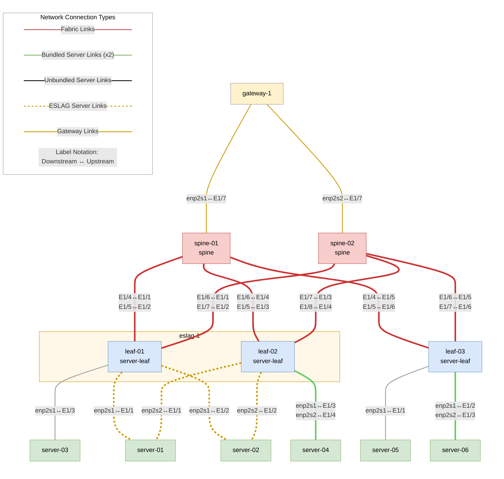
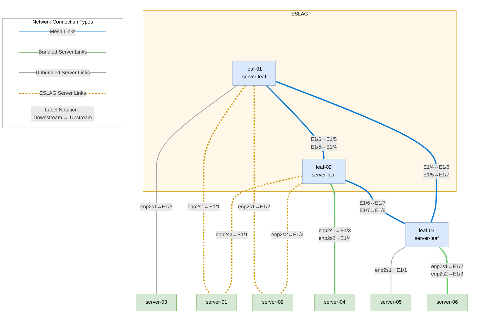
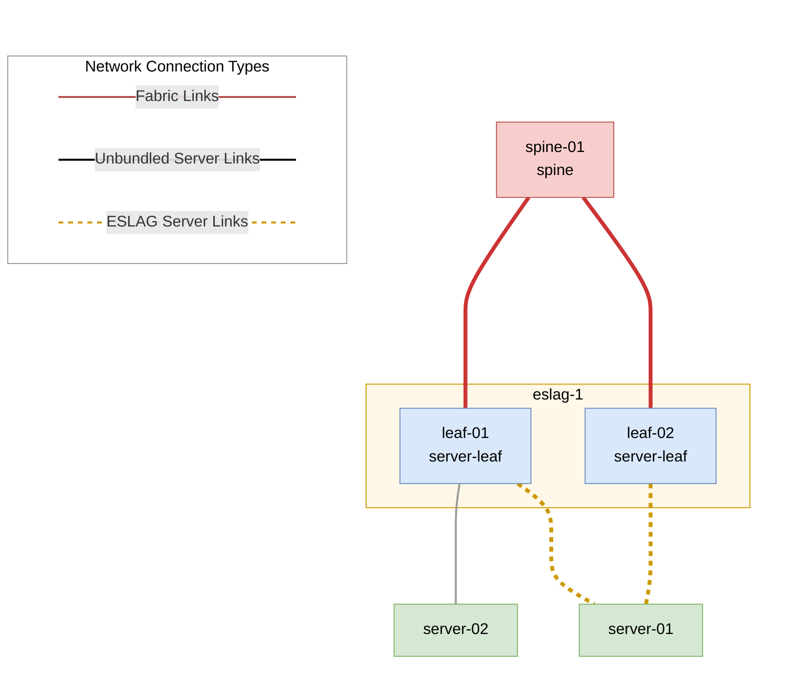

# Running VLAB

Make sure to follow the prerequisites and check system requirements in the [VLAB Overview](overview.md) section
before running VLAB.

## Initialize VLAB

First, initialize Fabricator by running `hhfab init --dev --gw`. This command creates the `fab.yaml` file, which is the main configuration file for the fabric. The `--gw` flag enables the gateway. This command supports several customization options that are listed in the output of `hhfab init --help`.

```console
ubuntu@docs:~$ hhfab init --dev --gw
10:26:45 INF Hedgehog Fabricator version=v0.43.1
10:26:45 INF Generated initial config
10:26:45 INF Adjust configs (incl. credentials, modes, subnets, etc.) file=fab.yaml
10:26:45 INF Include wiring (fabric/gateway) files (.yaml) or adjust imported ones dir=include
```
## VLAB Topology

### Spine-Leaf

To generate a spine-leaf topology, use `hhfab vlab gen`. The following generates an ESLAG (EVPN Multi-Homing) topology:

```console
ubuntu@docs:~$ hhfab vlab gen --mclag-leafs-count 0 --eslag-leaf-groups 2
10:26:46 INF Hedgehog Fabricator version=v0.43.1
10:26:46 INF Building VLAB wiring diagram fabricMode=spine-leaf
10:26:46 INF >>> spinesCount=2 fabricLinksCount=2 meshLinksCount=0
10:26:46 INF >>> eslagLeafGroups=2
10:26:46 INF >>> gatewayUplinks=2 gatewayDriver=kernel
10:26:46 INF >>> mclagLeafsCount=0 mclagSessionLinks=0 mclagPeerLinks=0
10:26:46 INF >>> orphanLeafsCount=1
10:26:46 INF >>> mclagServers=0 eslagServers=2 unbundledServers=1 bundledServers=1
10:26:46 INF >>> externalCount=0 externalMclagConnCount=0 externalEslagConnCount=0 externalOrphanConnCount=0
10:26:46 INF Generated wiring file name=vlab.generated.yaml
```

You can customize the topology with flags like `--spines-count` and `--eslag-leaf-groups`. For complete options, run `hhfab vlab gen -h`.

The topology with 2 spines, 2 ESLAG leaves, 1 orphan leaf, and a gateway is shown below:



You can jump [to the instructions](#build-the-installer-and-start-vlab) to start VLAB, or see the next section for customizing the topology.

### Mesh

To run the mesh topology, which does away with spine switches and connects leaves directly to each other,
use the `--mesh-links-count` flag.
This flag allows you to specify how many mesh links should be created between each pair of leaves.
For example, to create a mesh topology with 2 links between each pair of leaves, run:

```console
ubuntu@docs:~$ hhfab vlab gen --mesh-links-count 2
13:24:58 INF Hedgehog Fabricator version=v0.41.3
13:24:58 INF Building VLAB wiring diagram fabricMode=spine-leaf
13:24:58 INF >>> spinesCount=0 fabricLinksCount=0 meshLinksCount=2
13:24:58 INF >>> eslagLeafGroups=2
13:24:58 INF >>> mclagLeafsCount=0 mclagSessionLinks=0 mclagPeerLinks=0
13:24:58 INF >>> orphanLeafsCount=1
13:24:58 INF >>> mclagServers=2 eslagServers=2 unbundledServers=1 bundledServers=1
13:24:58 INF Generated wiring file name=vlab.generated.yaml
```

The default topology generated in this case will have 2 ESLAG leaves and 1 orphan leaf. Below is the corresponding diagram:



### Gateway

The gateway is enabled by adding the `--gw` flag to `hhfab init`. It connects to two spines in spine-leaf topology
or two leaves in mesh topology. The number of uplinks can be controlled using flags on `hhfab vlab gen`.

### Lightweight Spine-Leaf
A default spine-leaf topology in VLAB requests more CPU and RAM than is commonly available. The lightweight
topology requests 22 vCPUs and 23 GiB of RAM, it is 6 virtual machines, and still allows for traffic to transit a spine.
The lightweight spine-leaf topology is 2 ESLAG leaves, 1 spine, 1 ESLAG
Host, and 1 normal host. To launch the lightweight spine-leaf topology use the following command:

```console
ubuntu@docs:~$ hhfab vlab gen --eslag-leaf-groups=2 --spines-count=1 --bundled-servers=0 --eslag-servers=1 --unbundled-servers=1
20:10:16 INF Hedgehog Fabricator version=v0.42.0
20:10:16 INF Building VLAB wiring diagram fabricMode=spine-leaf
20:10:16 INF >>> spinesCount=1 fabricLinksCount=2 meshLinksCount=0
20:10:16 INF >>> eslagLeafGroups=2
20:10:16 INF >>> mclagLeafsCount=0 mclagSessionLinks=0 mclagPeerLinks=0
20:10:16 INF >>> orphanLeafsCount=0
20:10:16 INF >>> mclagServers=2 eslagServers=1 unbundledServers=1 bundledServers=0
20:10:16 INF Generated wiring file name=vlab.generated.yaml
```

The lightweight spine-leaf topology looks like this:



There are many customization options available for the VLAB topology. For a complete list of options, run `hhfab vlab gen -h`.

Additionally, you can pass extra Fabric configuration items using flags on `init` command or by passing a configuration
file. For more information, refer to the [Fabric Configuration](../install-upgrade/config.md) section.

Once you have initialized the VLAB, download the artifacts and build the installer using `hhfab build`. This command
automatically downloads all required artifacts from the OCI registry and builds the installer and all other
prerequisites for running the VLAB.

## Build the Installer and Start VLAB

To build and start the virtual machines, use `hhfab vlab up`. This command runs in the foreground and does not return, which allows you to stop all VLAB VMs by pressing `Ctrl + C`.
```console
ubuntu@docs:~$ hhfab vlab up
17:25:31 INF Hedgehog Fabricator version=v0.43.1
17:25:31 INF Wiring hydrated successfully mode=if-not-present
17:25:31 INF VLAB config loaded file=vlab/config.yaml
17:25:31 INF Downloader cache=/home/ubuntu/.hhfab-cache/v1 repo=ghcr.io prefix=githedgehog
17:25:31 INF Building control node installers
17:25:31 INF Building installer name=control-1 type=control mode=iso
17:25:31 INF Adding recipe bin and config to installer name=control-1 type=control mode=iso
17:25:33 INF Adding k3s and tools to installer name=control-1 type=control mode=iso
17:25:33 INF Adding toolbox to installer name=control-1 type=control mode=iso
17:25:34 INF Adding zot to installer name=control-1 type=control mode=iso
17:25:34 INF Adding flatcar upgrade bin to installer name=control-1 type=control mode=iso
17:25:34 INF Adding cert-manager to installer name=control-1 type=control mode=iso
17:25:34 INF Adding bash-completion to installer name=control-1 type=control mode=iso control=control-1
17:25:34 INF Adding config and wiring files to installer name=control-1 type=control mode=iso
17:25:34 INF Adding CLIs to installer name=control-1 type=control mode=iso
17:25:35 INF Building installer image, may take up to 5-10 minutes name=control-1 type=control mode=iso
...
17:25:48 INF Taps and bridge are ready count=7
17:25:48 INF Preparing new vm=control-1 type=control
17:26:28 INF Preparing new vm=gateway-1 type=gateway
17:27:12 INF Preparing new vm=server-01 type=server
17:27:14 INF Preparing new vm=server-02 type=server
17:27:16 INF Preparing new vm=server-03 type=server
17:27:17 INF Preparing new vm=server-04 type=server
17:27:19 INF Preparing new vm=server-05 type=server
17:27:21 INF Preparing new vm=server-06 type=server
17:27:23 INF Preparing new vm=leaf-01 type=switch
17:27:23 INF Preparing new vm=leaf-02 type=switch
17:27:23 INF Preparing new vm=leaf-03 type=switch
17:27:23 INF Preparing new vm=spine-01 type=switch
17:27:23 INF Preparing new vm=spine-02 type=switch
17:27:24 INF Starting VMs count=13 cpu="46 vCPUs" ram="42496 MB" disk="460 GB"
...
17:35:11 INF install(control-1): Jan 30 17:35:11 control-1 hhfab-recipe[1529]: Jan 30 17:35:11.024 INF Control node installation complete
17:35:21 INF All VMs are ready
17:35:21 INF All K8s nodes are ready
17:35:21 INF VLAB is ready

```
When the message `INF VLAB is ready` appears, the installer has finished. After this, you can get into the control
node and other VMs to watch the Fabric coming up and switches getting provisioned. See [Accessing the VLAB](#accessing-the-vlab).

## Enable Outside connectivity from VLAB VMs

By default, all test server VMs are isolated and have no connectivity to the host or the Internet. You can configure
enable connectivity using `hhfab vlab up --controls-restricted=false` to allow the test servers to access the Internet and
the host. When you enable connectivity, VMs get a default route pointing to the host, which means that in case of the
VPC peering you need to configure test server VMs to use the VPC attachment as a default route (or just some specific
subnets).


## Accessing the VLAB

The `hhfab vlab` command provides `ssh` and `serial` subcommands to access the VMs. You can use `ssh` to get into the
control node and test servers after the VMs are started. You can use `serial` to get into the switch VMs while they are
provisioning and installing the software. After switches are installed you can use `ssh` to get into them.

You can select device you want to access or pass the name using the `--vm` flag.

```console
ubuntu@docs:~$ hhfab vlab ssh
Use the arrow keys to navigate: ↓ ↑ → ←  and / toggles search
Select target for ssh:
  🦔 control-1
  gateway-1
  leaf-01
  leaf-02
  leaf-03
  server-01
  server-02
  server-03
  server-04
  server-05
  server-06
  spine-01
  spine-02
```
### Default credentials

Fabricator creates default users and keys for you to login into the control node and test servers as well as for the
SONiC Virtual Switches.

The default user with password-less sudo for the control node and test servers is `core` with password `HHFab.Admin!`.
The admin user with full access and password-less sudo for the switches is `admin` with password `HHFab.Admin!`.
The read-only, non-sudo user with access to the switch CLI is `op` with password `HHFab.Op!`.


## Use Kubectl to Interact with the Fabric
On the control node you have access to kubectl, Fabric CLI, and k9s to manage the Fabric. To view information
about the switches run `kubectl get agents -o wide`. After the control node is available it usually takes about 10-15 minutes for the
switches to get installed.

After the switches are provisioned, the command returns something like this:

```console
core@control-1 ~ $ kubectl get agents -o wide
NAME       ROLE          DESCR           HWSKU                      HEARTBEAT   APPLIED   APPLIEDG   CURRENTG   VERSION   SOFTWARE                ATTEMPT   ATTEMPTG   AGE
leaf-01    server-leaf   VS-01 ESLAG 1   DellEMC-S5248f-P-25G-DPB   11s         2m59s     1          1          v0.96.2   4.5.0-Enterprise_Base   2m59s     1          10m
leaf-02    server-leaf   VS-02 ESLAG 1   DellEMC-S5248f-P-25G-DPB   29s         3m17s     1          1          v0.96.2   4.5.0-Enterprise_Base   3m17s     1          10m
leaf-03    server-leaf   VS-03           DellEMC-S5248f-P-25G-DPB   19s         3m7s      1          1          v0.96.2   4.5.0-Enterprise_Base   3m7s      1          10m
spine-01   spine         VS-04           DellEMC-S5248f-P-25G-DPB   28s         3m16s     1          1          v0.96.2   4.5.0-Enterprise_Base   3m16s     1          10m
spine-02   spine         VS-05           DellEMC-S5248f-P-25G-DPB   17s         3m6s      1          1          v0.96.2   4.5.0-Enterprise_Base   3m6s      1          10m
```

The `Heartbeat` column shows how long ago the switch has sent the heartbeat to the control node. The `Applied` column
shows how long ago the switch has applied the configuration. `AppliedG` shows the generation of the configuration
applied. `CurrentG` shows the generation of the configuration the switch is supposed to run. Different values for
`AppliedG` and `CurrentG` mean that the switch is in the process of applying the configuration.

At that point Fabric is ready and you can use `kubectl` and `kubectl fabric` to manage the Fabric. You can find more
about managing the Fabric in the [Running Demo](demo.md) and [User Guide](../user-guide/overview.md) sections.

### Getting main Fabric objects

You can list the main Fabric objects by running `kubectl get` on the control node. You can find more details about
using the Fabric in the [User Guide](../user-guide/overview.md), [Fabric
API](../reference/fabric-api.md) and
[Fabric CLI](../reference/cli.md) sections.

For example, to get the list of switches, run:

```console
core@control-1 ~ $ kubectl get switch
NAME       PROFILE   ROLE          DESCR           GROUPS        AGE
leaf-01    vs        server-leaf   VS-01 ESLAG 1   ["eslag-1"]   10m
leaf-02    vs        server-leaf   VS-02 ESLAG 1   ["eslag-1"]   10m
leaf-03    vs        server-leaf   VS-03                         10m
spine-01   vs        spine         VS-04                         10m
spine-02   vs        spine         VS-05                         10m
```

Similarly, to get the list of servers, run:

```console
core@control-1 ~ $ kubectl get server
NAME        TYPE      DESCR                        AGE
control-1   control   Control node                 10m
server-01             S-01 ESLAG leaf-01 leaf-02   10m
server-02             S-02 ESLAG leaf-01 leaf-02   10m
server-03             S-03 Unbundled leaf-01       10m
server-04             S-04 Bundled leaf-02         10m
server-05             S-05 Unbundled leaf-03       10m
server-06             S-06 Bundled leaf-03         10m
```

For connections, use:

```console
core@control-1 ~ $ kubectl get connection
NAME                                 TYPE        AGE
server-01--eslag--leaf-01--leaf-02   eslag       10m
server-02--eslag--leaf-01--leaf-02   eslag       10m
server-03--unbundled--leaf-01        unbundled   10m
server-04--bundled--leaf-02          bundled     10m
server-05--unbundled--leaf-03        unbundled   10m
server-06--bundled--leaf-03          bundled     10m
spine-01--fabric--leaf-01            fabric      10m
spine-01--fabric--leaf-02            fabric      10m
spine-01--fabric--leaf-03            fabric      10m
spine-01--gateway--gateway-1         gateway     10m
spine-02--fabric--leaf-01            fabric      10m
spine-02--fabric--leaf-02            fabric      10m
spine-02--fabric--leaf-03            fabric      10m
spine-02--gateway--gateway-1         gateway     10m
```

For IPv4 and VLAN namespaces, use:

```console
core@control-1 ~ $ kubectl get ipns
NAME      SUBNETS           AGE
default   ["10.0.0.0/16"]   10m

core@control-1 ~ $ kubectl get vlanns
NAME      AGE
default   10m
```

## Reset VLAB

If VLAB is currently running, press `Ctrl + C` to stop it. To reset VLAB and start over run `hhfab init -f`. This option forces the process to overwrite your existing configuration in `fab.yaml`.

## Next steps

* [Running Demo](./demo.md)
