# Running VLAB

Make sure to follow the prerequisites and check system requirements in the [VLAB Overview](overview.md) section
before running VLAB.

## Initialize VLAB

First, initialize Fabricator by running `hhfab init --dev`. This command creates the `fab.yaml` file, which is the main configuration file for the fabric. This command supports several customization options that are listed in the output of `hhfab init --help`.

```console
ubuntu@docs:~$ hhfab init --dev
11:26:52 INF Hedgehog Fabricator version=v0.36.1
11:26:52 INF Generated initial config
11:26:52 INF Adjust configs (incl. credentials, modes, subnets, etc.) file=fab.yaml
11:26:52 INF Include wiring files (.yaml) or adjust imported ones dir=include
```
## VLAB Topology

By default, `hhfab init` creates 2 spines, 2 MCLAG leaves and 1 non-MCLAG leaf with 2 fabric connections (between each spine and leaf), 2 MCLAG peer links and 2 MCLAG session links. To generate the preceding topology, `hhfab vlab gen`. You can also configure the number of spines, leafs, connections, and so on. For example, flags `--spines-count` and `--mclag-leafs-count` allow you to set the number of spines and MCLAG leaves, respectively. For complete options, `hhfab vlab gen -h`.

```console
ubuntu@docs:~$ hhfab vlab gen
21:27:16 INF Hedgehog Fabricator version=v0.36.1
21:27:16 INF Building VLAB wiring diagram fabricMode=spine-leaf
21:27:16 INF >>> spinesCount=2 fabricLinksCount=2
21:27:16 INF >>> eslagLeafGroups=2
21:27:16 INF >>> mclagLeafsCount=2 mclagSessionLinks=2 mclagPeerLinks=2
21:27:16 INF >>> orphanLeafsCount=1
21:27:16 INF >>> mclagServers=2 eslagServers=2 unbundledServers=1 bundledServers=1
21:27:16 INF Generated wiring file name=vlab.generated.yaml
```

The default spine-leaf topology with 2 spines, 2 MCLAG leaves, and 1 non-MCLAG leaf:

```mermaid
graph TD

%% Style definitions
classDef spine   fill:#F8CECC,stroke:#B85450,stroke-width:1px,color:#000
classDef leaf    fill:#DAE8FC,stroke:#6C8EBF,stroke-width:1px,color:#000
classDef server  fill:#D5E8D4,stroke:#82B366,stroke-width:1px,color:#000
classDef mclag   fill:#F0F8FF,stroke:#6C8EBF,stroke-width:1px,color:#000
classDef eslag   fill:#FFF8E8,stroke:#CC9900,stroke-width:1px,color:#000
classDef hidden fill:none,stroke:none
classDef legendBox fill:white,stroke:#999,stroke-width:1px,color:#000

%% Network diagram
subgraph Spines[ ]
	direction LR
	subgraph Spine_01_Group [ ]
		direction TB
		Spine_01["spine-01<br>spine"]
	end
	subgraph Spine_02_Group [ ]
		direction TB
		Spine_02["spine-02<br>spine"]
	end
end

subgraph Leaves[ ]
	direction LR
	subgraph MCLAG [MCLAG]
		direction LR
		Leaf_01["leaf-01<br>server-leaf"]
		Leaf_02["leaf-02<br>server-leaf"]
	end

	subgraph ESLAG [ESLAG]
		direction LR
		Leaf_03["leaf-03<br>server-leaf"]
		Leaf_04["leaf-04<br>server-leaf"]
	end

	Leaf_05["leaf-05<br>server-leaf"]
end

subgraph Servers[ ]
	direction TB
	Server_03["server-03"]
	Server_01["server-01"]
	Server_02["server-02"]
	Server_04["server-04"]
	Server_07["server-07"]
	Server_05["server-05"]
	Server_06["server-06"]
	Server_08["server-08"]
	Server_09["server-09"]
	Server_10["server-10"]
end

%% Connections

%% Spine_01 -> Leaves
Spine_01 ---|"E1/8↔E1/1<br>E1/9↔E1/2"| Leaf_01
Spine_01 ---|"E1/10↔E1/4<br>E1/9↔E1/3"| Leaf_02
Spine_01 ---|"E1/4↔E1/5<br>E1/5↔E1/6"| Leaf_03
Spine_01 ---|"E1/4↔E1/9<br>E1/5↔E1/10"| Leaf_05
Spine_01 ---|"E1/5↔E1/7<br>E1/6↔E1/8"| Leaf_04

%% Spine_02 -> Leaves
Spine_02 ---|"E1/11↔E1/3<br>E1/12↔E1/4"| Leaf_02
Spine_02 ---|"E1/7↔E1/7<br>E1/8↔E1/8"| Leaf_04
Spine_02 ---|"E1/11↔E1/2<br>E1/10↔E1/1"| Leaf_01
Spine_02 ---|"E1/6↔E1/5<br>E1/7↔E1/6"| Leaf_03
Spine_02 ---|"E1/7↔E1/10<br>E1/6↔E1/9"| Leaf_05

%% Leaves -> Servers
Leaf_01 ---|"enp2s1↔E1/6"| Server_02
Leaf_01 ---|"enp2s1↔E1/7"| Server_03
Leaf_01 ---|"enp2s1↔E1/5"| Server_01

Leaf_02 ---|"enp2s2↔E1/5"| Server_01
Leaf_02 ---|"enp2s2↔E1/6"| Server_02
Leaf_02 ---|"enp2s1↔E1/7<br>enp2s2↔E1/8"| Server_04

Leaf_03 ---|"enp2s1↔E1/1"| Server_05
Leaf_03 ---|"enp2s1↔E1/2"| Server_06
Leaf_03 ---|"enp2s1↔E1/3"| Server_07

Leaf_04 ---|"enp2s2↔E1/2"| Server_06
Leaf_04 ---|"enp2s1↔E1/3<br>enp2s2↔E1/4"| Server_08
Leaf_04 ---|"enp2s2↔E1/1"| Server_05

Leaf_05 ---|"enp2s1↔E1/1"| Server_09
Leaf_05 ---|"enp2s1↔E1/2<br>enp2s2↔E1/3"| Server_10

subgraph Legend["Network Connection Types"]
	direction LR

	%% Create invisible nodes for the start and end of each line
	L1(( )) --- |"Fabric Links"| L2(( ))
	L3(( )) --- |"MCLAG Server Links"| L4(( ))
	L5(( )) --- |"Bundled Server Links"| L6(( ))
	L7(( )) --- |"Unbundled Server Links"| L8(( ))
	L9(( )) --- |"ESLAG Server Links"| L10(( ))
end

class Spine_01,Spine_02 spine
class Leaf_01,Leaf_02,Leaf_03,Leaf_04,Leaf_05 leaf
class Server_03,Server_01,Server_02,Server_04,Server_07,Server_05,Server_06,Server_08,Server_09,Server_10 server
class MCLAG mclag
class ESLAG eslag
class L1,L2,L3,L4,L5,L6,L7,L8,L9,L10 hidden
class Legend legendBox
linkStyle default stroke:#666,stroke-width:2px
linkStyle 0,1,2,3,4,5,6,7,8,9 stroke:#CC3333,stroke-width:4px
linkStyle 10,12,13,14 stroke:#99CCFF,stroke-width:4px,stroke-dasharray:5 5
linkStyle 15,20,23 stroke:#66CC66,stroke-width:4px
linkStyle 16,17,19,21 stroke:#CC9900,stroke-width:4px,stroke-dasharray:5 5
linkStyle 11,18,22 stroke:#999999,stroke-width:2px
linkStyle 24 stroke:#B85450,stroke-width:2px
linkStyle 25 stroke:#6C8EBF,stroke-width:2px,stroke-dasharray:5 5
linkStyle 26 stroke:#82B366,stroke-width:2px
linkStyle 27 stroke:#000000,stroke-width:2px
linkStyle 28 stroke:#CC9900,stroke-width:2px,stroke-dasharray:5 5

%% Make subgraph containers invisible
style Spines fill:none,stroke:none
style Leaves fill:none,stroke:none
style Servers fill:none,stroke:none
style Spine_01_Group fill:none,stroke:none
style Spine_02_Group fill:none,stroke:none
```



You can jump [to the instructions](#build-the-installer-and-start-vlab) to start VLAB, or see the next section for customizing the topology.

### Collapsed Core

!!! warning
    Collapsed Core is deprecated starting from 25.03 release and will be removed in a future releases. It'll be replaced
    by a new mesh topology that will work in a similar way to the spine-leaf topology but with leaf switches directly
    connected to each other.

If a Collapsed Core topology is desired, after the `hhfab init --dev` step, edit the resulting `fab.yaml` file and change the `mode: spine-leaf` to `mode: collapsed-core`:

```console
ubuntu@docs:~$ hhfab vlab gen
11:39:02 INF Hedgehog Fabricator version=v0.36.1
11:39:02 INF Building VLAB wiring diagram fabricMode=collapsed-core
11:39:02 INF >>> mclagLeafsCount=2 mclagSessionLinks=2 mclagPeerLinks=2
11:39:02 INF >>> orphanLeafsCount=0
11:39:02 INF >>> mclagServers=2 eslagServers=2 unbundledServers=1 bundledServers=1
11:39:02 INF Generated wiring file name=vlab.generated.yaml
```

The collapsed core topology with 2 MCLAG leaves:


### Lightweight Spine-Leaf 
A default spine-leaf topology in VLAB requests more CPU and RAM than is commonly available. The lightweight
topology requests 22 vCPUs and 23 GiB of RAM, it is 6 virtual machines, and still allows for traffic to transit a spine.
The lightweight spine-leaf topology is 2 ESLAG leaves, 1 spine, 1 ESLAG
Host, and 1 normal host. To launch the lightweight spine-leaf topology use the following command:

```console
ubuntu@docs:~$ hhfab vlab gen --eslag-leaf-groups=2 --spines-count=1 --bundled-servers=0 --eslag-servers=1 --unbundled-servers=1
20:10:16 INF Hedgehog Fabricator version=v0.42.0
20:10:16 INF Building VLAB wiring diagram fabricMode=spine-leaf
20:10:16 INF >>> spinesCount=1 fabricLinksCount=2 meshLinksCount=0
20:10:16 INF >>> eslagLeafGroups=2
20:10:16 INF >>> mclagLeafsCount=0 mclagSessionLinks=0 mclagPeerLinks=0
20:10:16 INF >>> orphanLeafsCount=0
20:10:16 INF >>> mclagServers=2 eslagServers=1 unbundledServers=1 bundledServers=0
20:10:16 INF Generated wiring file name=vlab.generated.yaml
```

The lightweight spine-leaf topology looks like this:


There are many customization options available for the VLAB topology. For a complete list of options, run `hhfab vlab gen -h`.

Additionally, you can pass extra Fabric configuration items using flags on `init` command or by passing a configuration
file. For more information, refer to the [Fabric Configuration](../install-upgrade/config.md) section.

Once you have initialized the VLAB, download the artifacts and build the installer using `hhfab build`. This command
automatically downloads all required artifacts from the OCI registry and builds the installer and all other
prerequisites for running the VLAB.

## Build the Installer and Start VLAB

To build and start the virtual machines, use `hhfab vlab up`. For successive runs, use the `--kill-stale` flag to ensure that any virtual machines from a previous run are gone. `hhfab vlab up` runs in the foreground and does not return, which allows you to stop all VLAB VMs by simply pressing `Ctrl + C`.
```console
ubuntu@docs:~$ hhfab vlab up
11:48:22 INF Hedgehog Fabricator version=v0.36.1
11:48:22 INF Wiring hydrated successfully mode=if-not-present
11:48:22 INF VLAB config created file=vlab/config.yaml
11:48:22 INF Downloader cache=/home/ubuntu/.hhfab-cache/v1 repo=ghcr.io prefix=githedgehog
11:48:22 INF Building installer control=control-1
11:48:22 INF Adding recipe bin to installer control=control-1
11:48:24 INF Adding k3s and tools to installer control=control-1
11:48:25 INF Adding zot to installer control=control-1
11:48:25 INF Adding cert-manager to installer control=control-1
11:48:26 INF Adding config and included wiring to installer control=control-1
11:48:26 INF Adding airgap artifacts to installer control=control-1
11:48:36 INF Archiving installer path=/home/ubuntu/result/control-1-install.tgz control=control-1
11:48:45 INF Creating ignition path=/home/ubuntu/result/control-1-install.ign control=control-1
11:48:46 INF Taps and bridge are ready count=8
11:48:46 INF Downloader cache=/home/ubuntu/.hhfab-cache/v1 repo=ghcr.io prefix=githedgehog
11:48:46 INF Preparing new vm=control-1 type=control
11:48:51 INF Preparing new vm=server-01 type=server
11:48:52 INF Preparing new vm=server-02 type=server
11:48:54 INF Preparing new vm=server-03 type=server
11:48:55 INF Preparing new vm=server-04 type=server
11:48:57 INF Preparing new vm=server-05 type=server
11:48:58 INF Preparing new vm=server-06 type=server
11:49:00 INF Preparing new vm=server-07 type=server
11:49:01 INF Preparing new vm=server-08 type=server
11:49:03 INF Preparing new vm=server-09 type=server
11:49:04 INF Preparing new vm=server-10 type=server
11:49:05 INF Preparing new vm=leaf-01 type=switch
11:49:06 INF Preparing new vm=leaf-02 type=switch
11:49:06 INF Preparing new vm=leaf-03 type=switch
11:49:06 INF Preparing new vm=leaf-04 type=switch
11:49:06 INF Preparing new vm=leaf-05 type=switch
11:49:06 INF Preparing new vm=spine-01 type=switch
11:49:06 INF Preparing new vm=spine-02 type=switch
11:49:06 INF Starting VMs count=18 cpu="54 vCPUs" ram="49664 MB" disk="550 GB"
11:49:59 INF Uploading control install vm=control-1 type=control
11:53:39 INF Running control install vm=control-1 type=control
11:53:40 INF control-install: 01:53:39 INF Hedgehog Fabricator Recipe version=v0.36.1 vm=control-1
11:53:40 INF control-install: 01:53:39 INF Running control node installation vm=control-1
12:00:32 INF control-install: 02:00:31 INF Control node installation complete vm=control-1
12:00:32 INF Control node is ready vm=control-1 type=control
12:00:32 INF All VMs are ready

```
When the message `INF Control node is ready vm=control-1 type=control` from the installer's output means that the installer has finished. After this line
has been displayed, you can get into the control node and other VMs to watch the Fabric coming up and switches getting
provisioned. See [Accessing the VLAB](#accessing-the-vlab).

## Enable Outside connectivity from VLAB VMs

By default, all test server VMs are isolated and have no connectivity to the host or the Internet. You can configure
enable connectivity using `hhfab vlab up --restrict-servers=false` to allow the test servers to access the Internet and
the host. When you enable connectivity, VMs get a default route pointing to the host, which means that in case of the
VPC peering you need to configure test server VMs to use the VPC attachment as a default route (or just some specific
subnets).


## Accessing the VLAB

The `hhfab vlab` command provides `ssh` and `serial` subcommands to access the VMs. You can use `ssh` to get into the
control node and test servers after the VMs are started. You can use `serial` to get into the switch VMs while they are
provisioning and installing the software. After switches are installed you can use `ssh` to get into them.

You can select device you want to access or pass the name using the `--vm` flag.

```console
ubuntu@docs:~$ hhfab vlab ssh
Use the arrow keys to navigate: ↓ ↑ → ←  and / toggles search
SSH to VM:
  🦔 control-1
  server-01
  server-02
  server-03
  server-04
  server-05
  server-06
  leaf-01
  leaf-02
  leaf-03
  spine-01
  spine-02

----------- VM Details ------------
ID:             0
Name:           control-1
Ready:          true
Basedir:        .hhfab/vlab-vms/control-1
```
### Default credentials

Fabricator creates default users and keys for you to login into the control node and test servers as well as for the
SONiC Virtual Switches.

The default user with password-less sudo for the control node and test servers is `core` with password `HHFab.Admin!`.
The admin user with full access and password-less sudo for the switches is `admin` with password `HHFab.Admin!`.
The read-only, non-sudo user with access to the switch CLI is `op` with password `HHFab.Op!`.


## Use Kubectl to Interact with the Fabric
On the control node you have access to kubectl, Fabric CLI, and k9s to manage the Fabric. To view information
about the switches run `kubectl get agents -o wide`. After the control node is available it usually takes about 10-15 minutes for the
switches to get installed.

After the switches are provisioned, the command returns something like this:

```console
core@control-1 ~ $ kubectl get agents -o wide
NAME       ROLE          DESCR           HWSKU                      ASIC   HEARTBEAT   APPLIED   APPLIEDG   CURRENTG   VERSION   SOFTWARE                ATTEMPT   ATTEMPTG   AGE
leaf-01    server-leaf   VS-01 MCLAG 1   DellEMC-S5248f-P-25G-DPB   vs     30s         5m5s      4          4          v0.23.0   4.1.1-Enterprise_Base   5m5s      4          10m
leaf-02    server-leaf   VS-02 MCLAG 1   DellEMC-S5248f-P-25G-DPB   vs     27s         3m30s     3          3          v0.23.0   4.1.1-Enterprise_Base   3m30s     3          10m
leaf-03    server-leaf   VS-03           DellEMC-S5248f-P-25G-DPB   vs     18s         3m52s     4          4          v0.23.0   4.1.1-Enterprise_Base   3m52s     4          10m
spine-01   spine         VS-04           DellEMC-S5248f-P-25G-DPB   vs     26s         3m59s     3          3          v0.23.0   4.1.1-Enterprise_Base   3m59s     3          10m
spine-02   spine         VS-05           DellEMC-S5248f-P-25G-DPB   vs     19s         3m53s     4          4          v0.23.0   4.1.1-Enterprise_Base   3m53s     4          10m
```

The `Heartbeat` column shows how long ago the switch has sent the heartbeat to the control node. The `Applied` column
shows how long ago the switch has applied the configuration. `AppliedG` shows the generation of the configuration
applied. `CurrentG` shows the generation of the configuration the switch is supposed to run. Different values for
`AppliedG` and `CurrentG` mean that the switch is in the process of applying the configuration.

At that point Fabric is ready and you can use `kubectl` and `kubectl fabric` to manage the Fabric. You can find more
about managing the Fabric in the [Running Demo](demo.md) and [User Guide](../user-guide/overview.md) sections.

### Getting main Fabric objects

You can list the main Fabric objects by running `kubectl get` on the control node. You can find more details about
using the Fabric in the [User Guide](../user-guide/overview.md), [Fabric
API](../reference/fabric-api.md) and
[Fabric CLI](../reference/cli.md) sections.

For example, to get the list of switches, run:

```console
core@control-1 ~ $ kubectl get switch
NAME       ROLE          DESCR           GROUPS   LOCATIONUUID                           AGE
leaf-01    server-leaf   VS-01 MCLAG 1            5e2ae08a-8ba9-599a-ae0f-58c17cbbac67   6h10m
leaf-02    server-leaf   VS-02 MCLAG 1            5a310b84-153e-5e1c-ae99-dff9bf1bfc91   6h10m
leaf-03    server-leaf   VS-03                    5f5f4ad5-c300-5ae3-9e47-f7898a087969   6h10m
spine-01   spine         VS-04                    3e2c4992-a2e4-594b-bbd1-f8b2fd9c13da   6h10m
spine-02   spine         VS-05                    96fbd4eb-53b5-5a4c-8d6a-bbc27d883030   6h10m
```

Similarly, to get the list of servers, run:

```console
core@control-1 ~ $ kubectl get server
NAME        TYPE      DESCR                        AGE
control-1   control   Control node                 6h10m
server-01             S-01 MCLAG leaf-01 leaf-02   6h10m
server-02             S-02 MCLAG leaf-01 leaf-02   6h10m
server-03             S-03 Unbundled leaf-01       6h10m
server-04             S-04 Bundled leaf-02         6h10m
server-05             S-05 Unbundled leaf-03       6h10m
server-06             S-06 Bundled leaf-03         6h10m
```

For connections, use:

```console
core@control-1 ~ $ kubectl get connection
NAME                                 TYPE           AGE
leaf-01--mclag-domain--leaf-02       mclag-domain   6h11m
server-01--mclag--leaf-01--leaf-02   mclag          6h11m
server-02--mclag--leaf-01--leaf-02   mclag          6h11m
server-03--unbundled--leaf-01        unbundled      6h11m
server-04--bundled--leaf-02          bundled        6h11m
server-05--unbundled--leaf-03        unbundled      6h11m
server-06--bundled--leaf-03          bundled        6h11m
spine-01--fabric--leaf-01            fabric         6h11m
spine-01--fabric--leaf-02            fabric         6h11m
spine-01--fabric--leaf-03            fabric         6h11m
spine-02--fabric--leaf-01            fabric         6h11m
spine-02--fabric--leaf-02            fabric         6h11m
spine-02--fabric--leaf-03            fabric         6h11m
```

For IPv4 and VLAN namespaces, use:

```console
core@control-1 ~ $ kubectl get ipns
NAME      SUBNETS           AGE
default   ["10.0.0.0/16"]   6h12m

core@control-1 ~ $ kubectl get vlanns
NAME      AGE
default   6h12m
```

## Reset VLAB

If VLAB is currently running, press `Ctrl + C` to stop it. To reset VLAB and start over run `hhfab init -f`. This option forces the process to overwrite your existing configuration in `fab.yaml`.

## Next steps

* [Running Demo](./demo.md)
