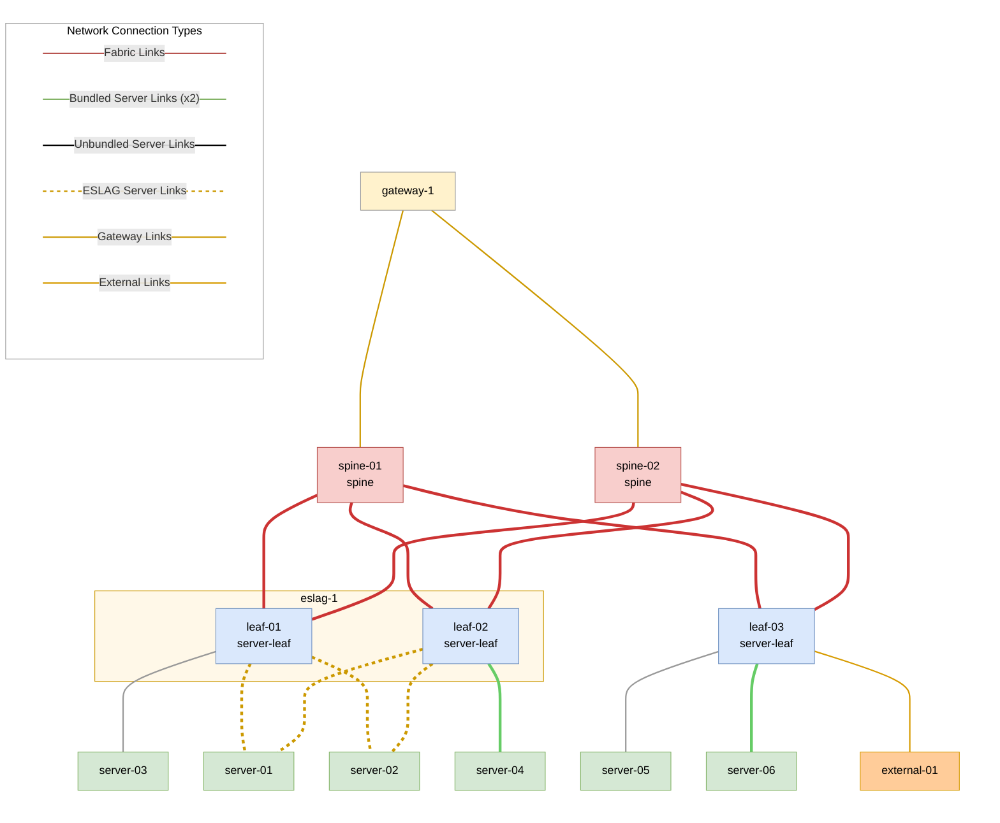

# Virtual Externals

VLAB also supports virtual [externals](../user-guide/external.md). These are implemented using
a virtual machine running [FRR](https://frrouting.org/), which is automatically configured
from the topology information to behave like one or more BGP instances advertising a default
route towards the internet (assuming the host running the VLAB is connected to the internet).

Here we will explain how to generate a topology with a virtual external, and how to test it
using either Fabric or Gateway external peerings.

## Creating the topology

Externals can be connected to any non-MCLAG leaf, whether in a spine-leaf topology or
a mesh one.

!!! warning
    Due to a [known limitation](../known-limitations/known-limitations.md#external-peering-over-a-connection-originating-from-an-mclag-switch-can-fail)
    with MCLAG and external peerings, connecting externals to MCLAG leaves is not recommended.

    Additionally, due to a limitation of the SONiC virtual switch implementation, having more than one
    external connection between virtual switches and an external will cause issues.
    This limitation does not apply to physical switches.

The example below shows how to initialize and generate a spine-leaf topology with two
ESLAG leaves, one orphan leaf with a virtual external attached to it, and a gateway
attached to the two spines:

```
ubuntu@docs:~/hhfab$ ./hhfab init -f --dev --gw
09:27:35 INF Hedgehog Fabricator version=v0.43.1
09:27:35 INF Generated initial config
09:27:35 INF Adjust configs (incl. credentials, modes, subnets, etc.) file=fab.yaml
09:27:35 INF Include wiring (fabric/gateway) files (.yaml) or adjust imported ones dir=include
ubuntu@docs:~/hhfab$ ./hhfab vlab gen --mclag-leafs-count=0 --eslag-leaf-groups=2 --orphan-leafs-count=1 --externals=1 --external-orphan-connections=1
09:28:36 INF Hedgehog Fabricator version=v0.43.1
09:28:36 INF Building VLAB wiring diagram fabricMode=spine-leaf
09:28:36 INF >>> spinesCount=2 fabricLinksCount=2 meshLinksCount=0
09:28:36 INF >>> eslagLeafGroups=2
09:28:36 INF >>> gatewayUplinks=2 gatewayDriver=kernel
09:28:36 INF >>> mclagLeafsCount=0 mclagSessionLinks=0 mclagPeerLinks=0
09:28:36 INF >>> orphanLeafsCount=1
09:28:36 INF >>> mclagServers=0 eslagServers=2 unbundledServers=1 bundledServers=1
09:28:36 INF >>> externalCount=1 externalMclagConnCount=0 externalEslagConnCount=0 externalOrphanConnCount=1
09:28:36 INF Generated wiring file name=vlab.generated.yaml
ubuntu@docs:~/hhfab$ ./hhfab vlab up -f -m=manual -r=wait
09:31:53 INF Hedgehog Fabricator version=v0.43.1
[...]
09:50:14 INF All switches and gateways are ready took=10m6.844960653s
09:50:14 INF All on-ready commands finished took=10m6.848788372s
```

Here's a graph of the resulting topology:


From the control node, we can verify that both the external and its attachment
to the orphan leaf have been created:

```
core@control-1 ~ $ kubectl get external
NAME                                                          EXTERNAL      CONNECTION          AGE
externalattachment.vpc.githedgehog.com/leaf-03--external-01   external-01   leaf-03--external   43m

NAME                                       IPV4NS    INCOMM       OUTCOMM      AGE
external.vpc.githedgehog.com/external-01   default   65102:1000   64102:1000   43m
```

## Demonstrating external peering

Let's first create some VPCs, using any of the methods described in [the demo page](demo.md),
e.g.:

```
ubuntu@docs:~/hhfab$ ./hhfab vlab setup-vpcs
10:29:26 INF Hedgehog Fabricator version=v0.43.1
10:29:26 INF Wiring hydrated successfully mode=if-not-present
10:29:26 INF VLAB config loaded file=vlab/config.yaml
10:29:26 INF Setting up VPCs and VPCAttachments mode="" perSubnet=1 perVPC=1 wait=true cleanup=false
10:29:26 INF Removing all peerings (VPC, External and Gateway)
10:29:27 INF Waiting for switches and gateways ready appliedFor=15s timeout=10m0s
10:29:27 INF Expected switches agent=v0.96.2 switches="[leaf-01 leaf-02 leaf-03 spine-01 spine-02]"
10:29:27 INF Expected gateways agent=v0.27.1 gateways=[gateway-1]
10:29:27 INF All switches and gateways are ready took=710.610466ms
10:29:27 INF Configuring VPCs and VPCAttachments
10:29:28 INF Created vpc=vpc-01 subnets=1
10:29:28 INF Created vpc=vpc-02 subnets=1
10:29:28 INF Created vpc=vpc-03 subnets=1
10:29:28 INF Created vpc=vpc-04 subnets=1
10:29:28 INF Created vpc=vpc-05 subnets=1
10:29:28 INF Created vpc=vpc-06 subnets=1
10:29:28 INF Created vpcattachment=server-01--eslag--leaf-01--leaf-02--vpc-01--subnet-01
10:29:28 INF Created vpcattachment=server-02--eslag--leaf-01--leaf-02--vpc-02--subnet-01
10:29:28 INF Created vpcattachment=server-03--unbundled--leaf-01--vpc-03--subnet-01
10:29:28 INF Created vpcattachment=server-04--bundled--leaf-02--vpc-04--subnet-01
10:29:28 INF Created vpcattachment=server-05--unbundled--leaf-03--vpc-05--subnet-01
10:29:28 INF Created vpcattachment=server-06--bundled--leaf-03--vpc-06--subnet-01
10:29:43 INF Waiting for switches and gateways ready appliedFor=15s timeout=10m0s
10:29:43 INF Expected switches agent=v0.96.2 switches="[leaf-01 leaf-02 leaf-03 spine-01 spine-02]"
10:29:43 INF Expected gateways agent=v0.27.1 gateways=[gateway-1]
10:29:43 INF Switches status notReady="[leaf-01 leaf-02 leaf-03]" notUpdated=[]
10:29:43 INF Gateways status notReady=[gateway-1] notUpdated=[]
10:30:13 INF Switches status notReady=[leaf-02] notUpdated=[]
10:30:18 INF All switches and gateways are ready took=35.188868988s
10:30:18 INF Configuring networking on servers
10:30:31 INF Configured server=server-05 addr=10.0.5.2/24 netconf="vlan 1005 enp2s1"
10:30:31 INF Configured server=server-03 addr=10.0.3.2/24 netconf="vlan 1003 enp2s1"
10:30:39 INF Configured server=server-02 addr=10.0.2.2/24 netconf="bond 1002 layer2+3 enp2s1 enp2s2"
10:30:40 INF Configured server=server-06 addr=10.0.6.2/24 netconf="bond 1006 layer2+3 enp2s1 enp2s2"
10:30:40 INF Configured server=server-01 addr=10.0.1.2/24 netconf="bond 1001 layer2+3 enp2s1 enp2s2"
10:30:40 INF Configured server=server-04 addr=10.0.4.2/24 netconf="bond 1004 layer2+3 enp2s1 enp2s2"
10:30:40 INF All servers configured and verified took=1m14.334925108s
```

By default, servers in VLAB are isolated from the internet; we can verify that either
using the test-connectivity utility of hhfab:

```
ubuntu@docs:~/hhfab$ ./hhfab vlab conns -v --curls=1 --pings=0 --iperfs=0
11:09:47 INF Hedgehog Fabricator version=v0.43.1
[...]
11:09:49 DBG Checking external connectivity from=server-03 expected=false
11:09:49 DBG Checking external connectivity from=server-01 expected=false
11:09:49 DBG Checking external connectivity from=server-02 expected=false
11:09:49 DBG Checking external connectivity from=server-04 expected=false
11:09:49 DBG Checking external connectivity from=server-06 expected=false
11:09:49 DBG Checking external connectivity from=server-05 expected=false
[...]
11:09:49 INF Test connectivity passed took=1.974696842s
```

Or by attempting to ping any well-known publicly available address from a server:
```
core@server-01 ~ $ ping -c 3 -W 1 8.8.8.8
PING 8.8.8.8 (8.8.8.8) 56(84) bytes of data.
From 10.0.4.1 icmp_seq=1 Destination Net Unreachable
From 10.0.4.1 icmp_seq=2 Destination Net Unreachable
From 10.0.4.1 icmp_seq=3 Destination Net Unreachable

--- 8.8.8.8 ping statistics ---
3 packets transmitted, 0 received, +3 errors, 100% packet loss, time 2004ms
```

Let's now connect some of the VPCs to the internet using the virtual external we created.

!!! warning
    Both types of peering rely on ACLs to prevent crosstalk between VPCs
    that are peered to the same external. Since virtual switches do not
    actually implement ACLs, in our VLAB peering multiple VPCs to the
    same external will result in those VPCs being able to talk to each
    other. This issue does not affect physical switches.

### External peering via the Fabric

We can create an external peering via the Fabric either using the hhfab utility or
by manually creating the necessary kubernetes objects. For example, using hhfab:

```
ubuntu@docs:~/hhfab$ ./hhfab vlab setup-peerings 1~external-01:s=subnet-01
10:49:42 INF Hedgehog Fabricator version=v0.43.1
10:49:42 INF Wiring hydrated successfully mode=if-not-present
10:49:42 INF VLAB config loaded file=vlab/config.yaml
10:49:42 INF Setting up VPC and External Peerings numRequests=1
10:49:42 INF Waiting for switches and gateways ready appliedFor=15s timeout=10m0s
10:49:43 INF Expected switches agent=v0.96.2 switches="[spine-02 leaf-01 leaf-02 leaf-03 spine-01]"
10:49:43 INF Expected gateways agent=v0.27.1 gateways=[gateway-1]
10:49:43 INF All switches and gateways are ready took=833.210714ms
10:49:44 INF Enforcing External Peering name=vpc-01--external-01 vpc=vpc-01 vpcSubnets=[subnet-01] external=external-01 externalPrefixes=[{Prefix:0.0.0.0/0}]
10:49:44 INF Created externalpeering=vpc-01--external-01
10:49:59 INF Waiting for switches and gateways ready appliedFor=15s timeout=10m0s
10:49:59 INF Expected switches agent=v0.96.2 switches="[leaf-03 spine-01 spine-02 leaf-01 leaf-02]"
10:49:59 INF Expected gateways agent=v0.27.1 gateways=[gateway-1]
10:49:59 INF Switches status notReady=[leaf-03] notUpdated=[]
10:50:24 INF All switches and gateways are ready took=25.016399952s
10:50:24 INF VPC and External Peerings setup complete took=41.484322857s
```

We can verify that the above command is equivalent to creating the following kubernetes object:

```
core@control-1 ~ $ kubectl get externalpeering vpc-01--external-01 -o yaml
apiVersion: vpc.githedgehog.com/v1beta1
kind: ExternalPeering
metadata:
  creationTimestamp: "2025-11-26T10:49:44Z"
  generation: 1
  labels:
    fabric.githedgehog.com/external: external-01
    fabric.githedgehog.com/vpc: vpc-01
  name: vpc-01--external-01
  namespace: default
  resourceVersion: "24079"
  uid: 6ceb8e2a-c4a8-4275-9106-ddfcf8d401ab
spec:
  permit:
    external:
      name: external-01
      prefixes:
      - prefix: 0.0.0.0/0
    vpc:
      name: vpc-01
      subnets:
      - subnet-01
```

We can now verify that server-01, attached to vpc-01, is able to reach the internet
via the virtual external, e.g.:

```
ubuntu@docs:~/hhfab$ ./hhfab vlab conns -v --source=server-01 --curls=1 --pings=0 --iperfs=0
10:53:36 INF Hedgehog Fabricator version=v0.43.1
[...]
10:53:38 DBG Checking external connectivity from=server-01 expected=true reason=switch-peering
10:53:38 DBG Running curls from=server-01 to=1.0.0.1 count=1
10:53:38 DBG Curl result from=server-01 to=1.0.0.1 expected=true ok=true fail=false err=<nil> stdout="<html>\n<head><title>301 Moved Permanently</title></head>\n<body>\n<center><h1>301 Moved Permanently</h1></center>\n<hr><center>cloudflare</center>\n</body>\n</html>\n" stderr=""
10:53:38 INF Test connectivity passed took=1.98032113s
```

Or alternatively, we can ssh to server-01 and manually check connectivity, e.g. with ping:

```
ubuntu@docs:~/hhfab$ ./hhfab vlab ssh -bn server-01
Last login: Wed Nov 26 10:53:36 UTC 2025 from 172.31.3.2 on ssh
Flatcar Container Linux by Kinvolk stable 4230.2.4 for QEMU
Hedgehog VLAB Server
Update Strategy: No Reboots
core@server-01 ~ $ ping -c 3 -W 1 8.8.8.8
PING 8.8.8.8 (8.8.8.8) 56(84) bytes of data.
64 bytes from 8.8.8.8: icmp_seq=1 ttl=252 time=10.6 ms
64 bytes from 8.8.8.8: icmp_seq=2 ttl=252 time=9.29 ms
64 bytes from 8.8.8.8: icmp_seq=3 ttl=252 time=15.6 ms

--- 8.8.8.8 ping statistics ---
3 packets transmitted, 3 received, 0% packet loss, time 2004ms
rtt min/avg/max/mdev = 9.286/11.825/15.591/2.716 ms
```

### External peering via the Gateway

We can repeat the above experiment with another VPC, this time peering
it to the external via the gateway. Once again, we can do so either
using the hhfab utility:

```
ubuntu@docs:~/hhfab$ ./hhfab vlab setup-peerings 4~external-01:s=subnet-01:gw
11:03:12 INF Hedgehog Fabricator version=v0.43.1
11:03:12 INF Wiring hydrated successfully mode=if-not-present
11:03:12 INF VLAB config loaded file=vlab/config.yaml
11:03:12 INF Setting up VPC and External Peerings numRequests=1
11:03:12 INF Waiting for switches and gateways ready appliedFor=15s timeout=10m0s
11:03:12 INF Expected switches agent=v0.96.2 switches="[leaf-02 leaf-03 spine-01 spine-02 leaf-01]"
11:03:12 INF Expected gateways agent=v0.27.1 gateways=[gateway-1]
11:03:13 INF All switches and gateways are ready took=747.345082ms
11:03:13 INF Deleting ExternalPeering name=vpc-01--external-01
11:03:13 INF Enforcing GatewayPeering name=vpc-04--external-01 vpc1=vpc-04 vpc2=ext.external-01
11:03:13 INF Created gwpeering=vpc-04--external-01
11:03:28 INF Waiting for switches and gateways ready appliedFor=15s timeout=10m0s
11:03:28 INF Expected switches agent=v0.96.2 switches="[leaf-01 leaf-02 leaf-03 spine-01 spine-02]"
11:03:28 INF Expected gateways agent=v0.27.1 gateways=[gateway-1]
11:03:28 INF Switches status notReady=[leaf-03] notUpdated=[]
11:03:28 INF Gateways status notReady=[gateway-1] notUpdated=[]
11:03:48 INF All switches and gateways are ready took=20.008712634s
11:03:48 INF VPC and External Peerings setup complete took=36.467660151s
```

or by creating a gateway peering object like the one that we just generated:

```
core@control-1 ~ $ kubectl get peering vpc-04--external-01 -o yaml
apiVersion: gateway.githedgehog.com/v1alpha1
kind: Peering
metadata:
  creationTimestamp: "2025-11-26T11:03:13Z"
  generation: 1
  labels:
    vpc.gateway.githedgehog.com/ext.external-01: "true"
    vpc.gateway.githedgehog.com/vpc-04: "true"
  name: vpc-04--external-01
  namespace: default
  resourceVersion: "28024"
  uid: 6e04519f-b599-488e-913b-7a28e01899d5
spec:
  peering:
    ext.external-01:
      expose:
      - ips:
        - cidr: 0.0.0.0/0
    vpc-04:
      expose:
      - ips:
        - cidr: 10.0.4.0/24
```

In this case, traffic from server-04 destined to the internet will go first
to the gateway and then to the external via the attached orphan leaf. We can
verify that this works in the same way we just did with Fabric peerings:

```
ubuntu@docs:~/hhfab$ ./hhfab vlab conns -v --source=server-04 --curls=1 --pings=0 --iperfs=0
11:06:49 INF Hedgehog Fabricator version=v0.43.1
[...]
11:06:51 DBG Checking external connectivity from=server-04 expected=true reason=gateway-peering peering=vpc-04--external-01
11:06:51 DBG Running curls from=server-04 to=1.0.0.1 count=1
11:06:51 DBG Curl result from=server-04 to=1.0.0.1 expected=true ok=true fail=false err=<nil> stdout="<html>\n<head><title>301 Moved Permanently</title></head>\n<body>\n<center><h1>301 Moved Permanently</h1></center>\n<hr><center>cloudflare</center>\n</body>\n</html>\n" stderr=""
11:06:51 INF Test connectivity passed took=1.961998153s
```

Or manually on server-04:

```
ubuntu@docs:~/hhfab$ ./hhfab vlab ssh -bn server-04
Last login: Wed Nov 26 11:06:50 UTC 2025 from 172.31.6.2 on ssh
Flatcar Container Linux by Kinvolk stable 4230.2.4 for QEMU
Hedgehog VLAB Server
Update Strategy: No Reboots
core@server-04 ~ $ ping -c 3 -W 1 8.8.8.8
PING 8.8.8.8 (8.8.8.8) 56(84) bytes of data.
64 bytes from 8.8.8.8: icmp_seq=1 ttl=251 time=13.7 ms
64 bytes from 8.8.8.8: icmp_seq=2 ttl=251 time=21.6 ms
64 bytes from 8.8.8.8: icmp_seq=3 ttl=251 time=57.8 ms

--- 8.8.8.8 ping statistics ---
3 packets transmitted, 3 received, 0% packet loss, time 2003ms
rtt min/avg/max/mdev = 13.678/31.019/57.824/19.224 ms
```
